# MySQL单表&约束&事务

# **1.** ***DQL******操作单表***

## **1.1** ***创建数据库***复制表

1) 创建一个新的数据库 db2

CREATE DATABASE db2 CHARACTER SET utf8;

2) 将db1数据库中的 emp表 复制到当前 db2数据库

## **1.2** ***排序***

通过ORDER BY子句可以将查询出的结果进行排序(排序只是显示效果不会影响真实数据

语法结构

SELECT 字段名 FROM 表名 [WHERE 字段 = 值] ORDER BY 字段名 [ASC / DESC]

| **ASC** **表示升序排序**(默认) |
| ------------------------------ |
| **DESC** **表示降序排序**      |

### **1.2.1** **排序方式**

1) 单列排序：只按照某一字段进行排序

需求1:

使用 salary 字段,对emp 表数据进行排序 (升序/降序)

默认的升序排序：

```mysql
SELECT * FROM emp ORDER BY salary;
```

 降序排序：

```mysql
SELECT * FROM emp ORDER BY salary DESC;
```

2) 组合排序:同时对多个字段进行排序如果第一个字段相同 就按照第二个字段进行排序以此类推

需求2:

在薪水排序的基础上,再使用id进行排序, 如果薪水相同就以id 做降序排序

```mysql
 SELECT * FROM emp ORDER BY salary DESC,eid DESC;
```

## **1.3** 聚合函数

之前我们做的查询都是横向查询，它们都是根据条件一行一行的进行判断，而使用聚合函数查询是纵向查询，它是对某一列的值进行计算，然后返回一个单一的值(另外聚合函数会忽略null空值。

语法结构：

SELECT 聚合函数(字段名) FROM 表名;

我们来学习5个聚合函数：

| **聚合函数** | **作用**                     |
| ------------ | ---------------------------- |
| count(字段)  | 统计指定列不为NULL的记录行数 |
| sum(字段)    | 计算指定列的数值和           |
| max(字段)    | 计算指定列的最大值           |
| min(字段)    | 计算指定列的最小值           |
| avg(字段)    | 计算指定列的平均值           |

 需求1:

```
#1 查询员工的总数
#2 查看员工总薪水、最高薪水、最小薪水、薪水的平均值
#3 查询薪水大于4000员工的个数
#4 查询部门为'教学部'的所有员工的个数
#5 查询部门为'市场部'所有员工的平均薪水
```

SQL实现

```mysql
 #1 查询员工的总数
SELECT COUNT(*) FROM emp;
#2 查看员工总薪水、最高薪水、最小薪水、薪水的平均值
SELECT 
MAX(salary) '最高薪水',
MIN(salary) '最低薪水',
SUM(salary)  '总薪水',
AVG(salary) '平均薪水'
FROM emp
#3 查询薪水大于4000员工的个数
SELECT COUNT(*) FROM emp WHERE salary>4000
#4 查询部门为'教学部'的所有员工的个数
SELECT COUNT(*) FROM emp WHERE dept_name = '教学部';
#5 查询部门为'市场部'所有员工的平均薪水
SELECT AVG(salary) FROM emp WHERE dept_name = '市场部'
```

## **1.4** ***分组***

分组查询指的是使用GROUP BY语句对查询的信息进行分组相同数据作为一组。

语法格式

```
SELECT 分组字段/聚合函数 FROM 表名 GROUP BY 分组字段 [HAVING 条件];
```

需求1: 通过性别字段 进行分组

**-- 按照性别进行分组操作SELECT * FROM emp GROUP BY sex; -- 注意 这样写没有意义**

分析: GROUP BY 分组过程

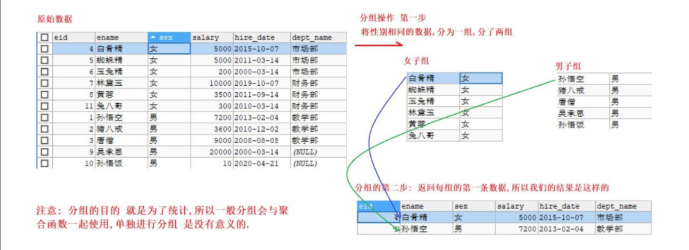

注意:

分组时可以查询要分组的字段, 或者使用聚合函数进行统计操作.查询其他字段没有意义

需求1: 通过性别字段 进行分组,求各组的平均薪资

```mysql
 	SELECT sex,AVG(salary)  FROM emp GROUP BY sex
```

需求2:

```
#1.查询所有部门信息
#2.查询每个部门的平均薪资
#3.查询每个部门的平均薪资, 部门名称不能为null
```

SQL实现

```mysql
#1.查询所有部门信息
SELECT dept_name '部门名称' FROM emp GROUP BY dept_name
#2.查询每个部门的平均薪资
SELECT dept_name '部门名称' ,  AVG(salary) '平均薪资' FROM emp GROUP BY dept_name;
#3.查询每个部门的平均薪资, 部门名称不能为null
SELECT dept_name '部门名称',AVG (salary)'平均薪资' FROM emp WHERE dept_name IS NOT NULL GROUP BY dept_name;
```

需求3:

查询平均薪资大于6000的部门.

分析:

1) hiving 需要在分组后,对数据进行过滤,使用 关键字

2) 分组操作中的having子语句，是用于在分组后对数据进行过滤的，作用类似于where条件。

SQL实现:

```mysql
 SELECT 
dept_name, 
AVG (salary) 
FROM emp
WHERE dept_name IS NOT NULL GROUP BY dept_name
HAVING AVG (salary)>6000
```

- where与having的区别

| **过滤方式** | **特点**                                       |
| ------------ | ---------------------------------------------- |
| where        | where 进行分组前的过滤where 后面不能写聚合函数 |
| having       | having 是分组后的过滤having 后面可以写聚合函数 |

## **1.5** limit关键字

limit 关键字的作用

limit是限制的意思,用于 限制返回的查询结果的行数 (可以通过limit指定查询多少行数据) 

limit 语法是 MySql的方言,用来完成分页

语法结构

```
SELECT 字段1,字段2... FROM 表名 LIMIT offset , length;
```

参数说明

| limit offset , length; 关键字可以接受一个 或者两个 为0 或者正整数的参数 |
| ------------------------------------------------------------ |
| offset 起始行数, 从0开始记数, 如果省略 则默认为 0.            |
| length 返回的行数（也就是要查询几条数据）                    |

需求1:

- 查询emp表中的前 5条数据 
- 查询emp表中 从第4条开始,查询6条

SQL实现

```mysql
 SELECT * FROM emp LIMIT 0,5

 SELECT * FROM emp LIMIT 3,6
```

需求2: 分页操作 每页显示3条数据

SQL实现

```mysql
SELECT * FROM emp LIMIT 0,3
SELECT * FROM emp LIMIT 3,3
SELECT * FROM emp LIMIT 6,3

-- 分页查询公式  起始行数 = （当前页码 - 1）*每页查询条数
```

# **2.** ***SQL******约束***

1) 约束的作用:

对表中的数据进行进一步的限制，从而保证数据的正确性、有效性、完整性. 违反约束的不正确数据,将无法插入到表中

2) 常见的约束

| **约束名** | **约束关键字** |
| ---------- | -------------- |
| 主键       | primary key    |
| 唯一       | unique         |
| 非空       | not null       |
| 外键       | foreign key    |

## **2.1** ***主键约束***

| **特点** | **不可重复, 唯一, 非空**     |
| -------- | ---------------------------- |
| **作用** | 用来表示数据库中的每一条记录 |

### **2.1.1** ***添加主键约束***

1）语法格式

字段名 字段类型 primary key

2）需求: 创建一个带主键的表

方式一：创建一个带有主键的表

```mysql
CREATE TABLE emp2(
   eid INT PRIMARY KEY,
   ename VARCHAR(20),
   sex VARCHAR(1)
)
```

DESC 查看表结构

-- 查看表的详细信息DESC emp2;

方式二：创建一个带有主键的表

```mysql
CREATE TABLE emp2(
  eid INT ,
  ename VARCHAR(20),
  sex VARCHAR(1),
  PRIMARY KEY(eid)
);
```

 方式三：创建一个带有主键的表

```mysql
CREATE TABLE emp2(
   eid INT,
   ename VARCHAR(20),
   sex CHAR(1)
);

ALTER TABLE emp2 ADD  PRIMARY KEY (eid)
```

测试主键的唯一性 非空性

如果主键为空，那么会报错。

3) 哪些字段可以设置为主键？

- 通常针对业务去设计主键,每张表都设计一个主键id

- 主键是给数据库和程序使用的,跟最终的客户无关,所以主键没有意义没有关系,只要能够保证不重复 就好,比如 身份证就可以作为主键.


### **2.1.2** 删除主键约束

删除 表中的主键约束 (了解)

-- 使用DDL语句 删除表中的主键

```mysql
ALTER TABLE emp2 DROP PRIMARY KEY;
DESC emp2;
```

### **2.1.3** ***主键的自增***

主键如果让我们自己添加很有可能重复我们通常希望在每次插入新记录时数据库自动生成主键字段的值

关键字:AUTO_INCREMENT 表示自动增长(字段类型必须是整数类型)

创建主键自增的表

```mysql
 CREATE TABLE emp2(
  eid INT PRIMARY KEY AUTO_INCREMENT,
  ename VARCHAR(20),
  sex CHAR(1)
);
```

添加数据 观察主键的自增

```mysql
INSERT INTO emp2(ename,sex) VALUES('张三','男'); 
INSERT INTO emp2(ename,sex) VALUES('李四','男'); 
INSERT INTO emp2 VALUES(NULL,' 翠 花 ',' 女 '); 
INSERT INTO emp2 VALUES(NULL,'艳秋','女');
```

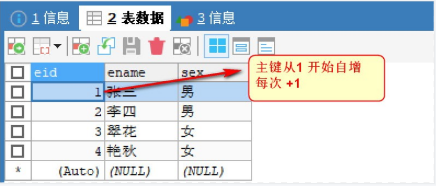

### **2.1.4** ***修改主键自增的起始值***

默认地AUTO_INCREMENT的开始值是1请使用下面的方式

-- 创建主键自增的表,自定义自增其实值

```mysql
CREATE TABLE emp2(

eid INT PRIMARY KEY AUTO_INCREMENT, 
ename VARCHAR(20),
sex CHAR(1)
)AUTO_INCREMENT=100;
```

-- 插入数据,观察主键的起始值

```mysql
INSERT INTO emp2(ename,sex) VALUES('张百万','男'); 

INSERT INTO emp2(ename,sex) VALUES('艳秋','女');
```

### **2.1.5** DELETE和TRUNCATE对自增长的影响

删除表中所有数据有两种方式

| **清空表数据的方式** | **特点**                                                     |
| -------------------- | ------------------------------------------------------------ |
| DELETE               | 删除表中的数据，将表中的数据逐条删除                         |
| TRUNCATE             | truncate是删除表中的所有数据，将整个表删除，然后再创建一个结构相同的表 |

测试1:	delete 删除表中所有数据（对主键没有影响）

```mysql
-- 目前最后的主键值是 101 SELECT * FROM emp2;

-- delete 删除表中数据,对自增没有影响

DELETE FROM emp2;

-- 插入数据 查看主键

INSERT INTO emp2(ename,sex) VALUES('张百万','男'); INSERT INTO emp2(ename,sex) VALUES('艳秋','女');
```


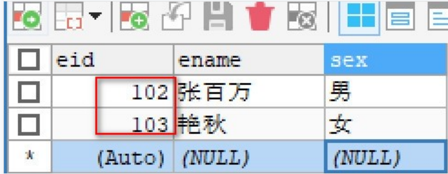


测试2: truncate删除 表中数据

```mysql
-- 使用 truncate 删除表中所有数据, TRUNCATE TABLE emp2;


-- 插入数据 查看主键
INSERT INTO emp2(ename,sex) VALUES('张百万','男'); INSERT INTO emp2(ename,sex) VALUES('艳秋','女');
```

   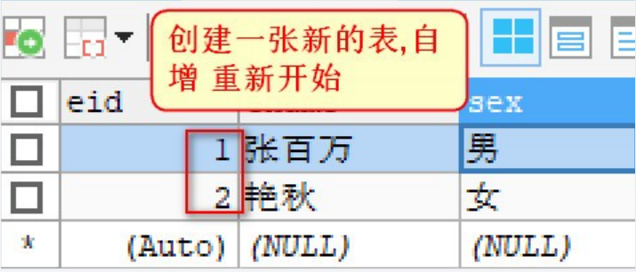


## **2.2** ***非空约束***

#### 非空约束的特点某一列不予许为空

语法格式

字段名 字段类型 not null

需求1: 为 ename 字段添加非空约束

```mysql
CREATE TABLE emp2(
eid INT PRIMARY KEY AUTO_INCREMENT,
ename VARCHAR(20) NOT NULL,
sex CHAR(1)
) 
```

如果你的ename为空会报错：

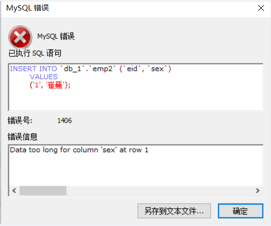

## **2.3** 唯一约束

唯一约束的特点表中的某一列的值不能重复(对null不做唯一的判断)

语法格式

字段名 字段值 unique

1) 添加唯一约束

```mysql
CREATE TABLE EMP3(
 eid INT PRIMARY KEY,
 ename VARCHAR(20)UNIQUE,
 sex CHAR(1)
);
```

2) 测试唯一约束

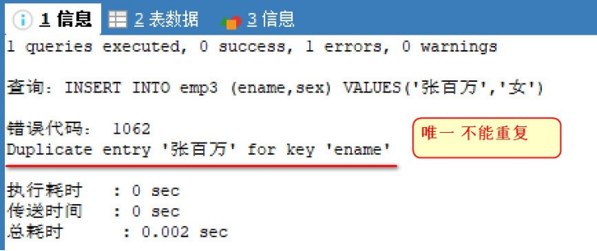 

| 主键约束与唯一约束的区别                           |
| -------------------------------------------------- |
| 1. 主键约束 唯一且不能够为空                       |
| 2. 唯一约束,唯一 但是可以为空                      |
| 3. 一个表中只能有一个主键 , 但是可以有多个唯一约束 |

## **2.4** ***外键约束***

- FOREIGN KEY表示外键约束，将在多表中学习。

## **2.5** 默认值

**默认值约束 用来指定某列的默认值**

语法格式

字段名 字段类型 **DEFAULT** 默认值

1) 创建emp4表, 性别字段默认 女

```mysql
-- 创建带有默认值的表
CREATE TABLE emp4(
eid INT PRIMARY KEY AUTO_INCREMENT,
-- 为ename 字段添加默认值
ename VARCHAR(20) DEFAULT '奥利给', sex CHAR(1)

);
```

2) 测试 添加数据使用默认值

```mysql
 -- 添加数据 使用默认值
INSERT INTO emp4(ename,sex) VALUES(DEFAULT,'男'); INSERT INTO emp4(sex) VALUES('女');
-- 不使用默认值
INSERT INTO emp4(ename,sex) VALUES('艳秋','女');
```

不使用默认值，自己进行设定的话，会把默认值覆盖掉。

# **3.** ***数据库事务***

## **3.1** ***什么是事务***

事务是一个整体,由一条或者多条SQL 语句组成,这些SQL语句要么都执行成功,要么都执行失败, 只要有一条SQL出现异常,整个操作就会回滚,整个业务执行失败。

比如: 银行的转账业务,张三给李四转账500元 , 至少要操作两次数据库, 张三 -500, 李四 + 500,这中间任何一步出现问题,整个操作就必须全部回滚, 这样才能保证用户和银行都没有损失.

回滚：即在事务运行的过程中发生了某种故障，事务不能继续执行，系统将事务中对数据库的所有已完成  的操作全部撤销，滚回到事务开始时的状态。（在提交之前执行）


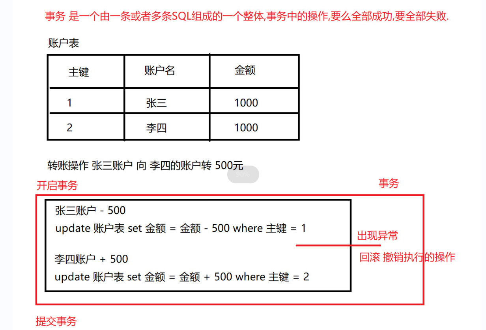

## **3.2** ***模拟转账操作***

1) 创建 账户表

```mysql
 -- 创建账户表
CREATE TABLE account(
-- 主键
id INT PRIMARY KEY AUTO_INCREMENT,
-- 姓名
NAME VARCHAR(10),
-- 余额
money DOUBLE
);

-- 添加两个用户
INSERT INTO account (NAME, money) VALUES ('tom', 1000), ('jack', 1000);
```

2) 模拟tom 给 jack 转 500 元钱，一个转账的业务操作最少要执行下面的 2 条语句：

```mysql
 -- tom账户 -500元

UPDATE account SET money = money - 500 WHERE NAME = 'tom';

-- jack账户 + 500元

UPDATE account SET money = money + 500 WHERE NAME = 'jack';
```

假设当tom账号上 -500 元,服务器崩溃了。jack 的账号并没有+500 元，数据就出现问题了。

我们要保证整个事务执行的完整性,要么都成功,  要么都失败.  这个时候我们就要学习如何操作事务.


## **3.3** ***MySQL******事务操作***

MYSQL 中可以有两种方式进行事务的操作： 

- 手动提交事务
- 自动提交事务


### **3.3.1** ***手动提交事务***

#### **3.3.1.1** 语法格式

 

| **功能** | **语句**                               |
| -------- | -------------------------------------- |
| 开启事务 | **start transaction;** 或者 **BEGIN**; |
| 提交事务 | **commit;**                            |
| 回滚事务 | **rollback;**                          |

- start transaction

​      这个语句显式地标记一个事务的起始点。

- commit

​     表示提交事务，即提交事务的所有操作，具体地说，就是将事务中所有对数据库的更新都写 到磁盘上的物理数据库中，事务正常结束。

- rollback

​     表示撤销事务，即在事务运行的过程中发生了某种故障，事务不能继续执行，系统将事务中 对数据库的所有已完成的操作全部撤销，回滚到事务开始时的状态

#### **3.3.1.2** 手动提交事务流程

- 执行成功的情况： 开启事务 -> 执行多条 SQL 语句 -> 成功提交事务
- 执行失败的情况： 开启事务 -> 执行多条 SQL 语句 -> 事务的回滚


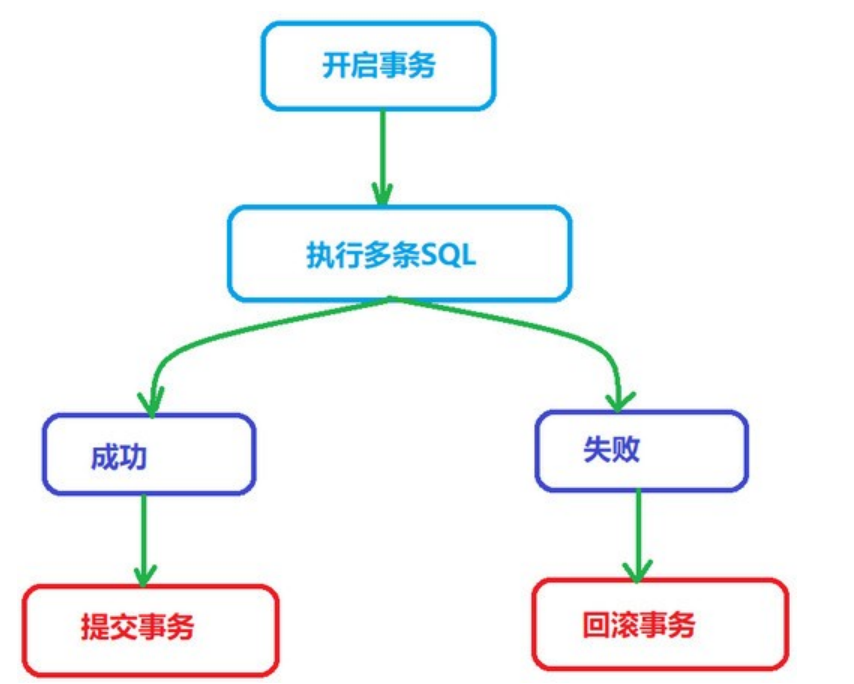 


已安装 mysql ，但无 MySQL Command Line Client 在 **mysql 安装目录下的bin目录中**进入cmd 输入 mysql -hlocalhost -uroot -p 输入 mysql 的数据库连接密码 mysql command line client 默认密码_ MySql Command Line Client 使用

#### **3.3.1.3**成功案例 演示

模拟张三给李四转 500 元钱

命令行登录数据库

 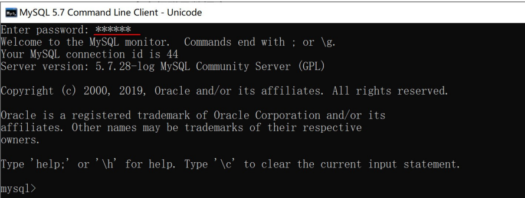


2) 使用db1数据库

USE db_1;

执行以下SQL

3)开启事务

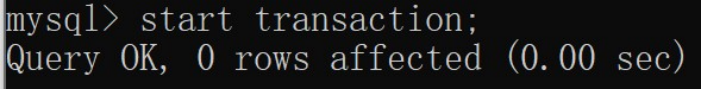 

4)tom账户  -500

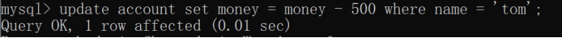 

3.3 jack账户 +500

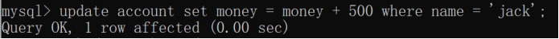 

4) 此时我们使用 sqlYog查看表,发现数据并没有改变

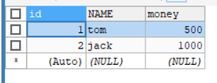

 

5) 在控制台执行 commit 提交事务

```
commit;
```

6) 再次使用sqlYog查看, 发现数据在事务提交之后,发生改变

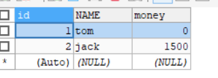 


#### **3.3.1.4** 事务回滚演示

如果事务中，有某条sql语句执行时报错了，我们没有手动的commit，那整个事务会自动回滚

1)命令行 开启事务

```
start transaction;
```

2) 插入两条数据

```mysql
INSERT INTO account VALUES(NULL,'张百万',3000);

 INSERT INTO account VALUES(NULL,'有财',3500);
```

3) 不去提交事务 直接关闭窗口,发生回滚操作,数据没有改变

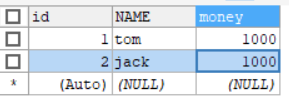

#### 注意：

如果事务中 SQL 语句没有问题，commit 提交事务，会对数据库数据的数据进行改变。 如果事务中 SQL 语句有问题，rollback 回滚事务，会回退到开启事务时的状态。

### **3.3.2** 自动提交事务

MySQL 默认每一条 DML(增删改)语句都是一个单独的事务，每条语句都会自动开启一个事务，语句执行完毕 自动提交事务，MySQL 默认开始自动提交事务

MySQL默认是自动提交事务

#### **3.3.2.1** ***自动提交事务演示***

1) 将tom账户金额 +500元

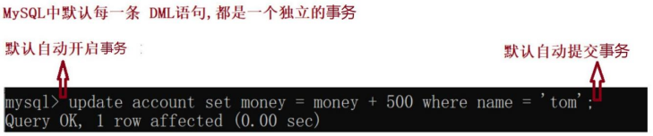 

 

2) 

使用 SQLYog 查看数据库：发现数据已经改变


 

#### **3.3.2.2** ***取消自动提交***

- MySQL默认是自动提交事务,设置为手动提交.


1）登录mysql，查看autocommit状态。也就是查看事务的提交方式

```
SHOW VARIABLES LIKE 'autocommit';
```

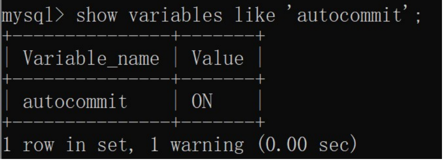

| **on** **：自动提交** |
| --------------------- |
| **off :** **手动提交** |

2) 把 autocommit 改成 off;

```
SET @@autocommit=off;
```


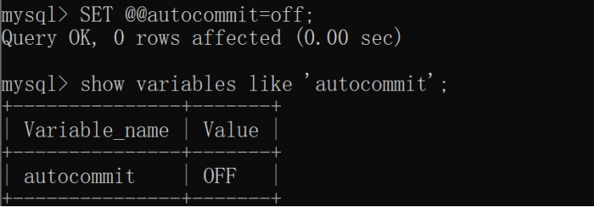 

3) 再次修改,需要提交之后才生效将jack 账户金额 -500元

```
-- 选择数据库use db2; 
-- 修改数据update account set money = money - 500 where name = 'jack'; 
-- 手动提交commit;
```

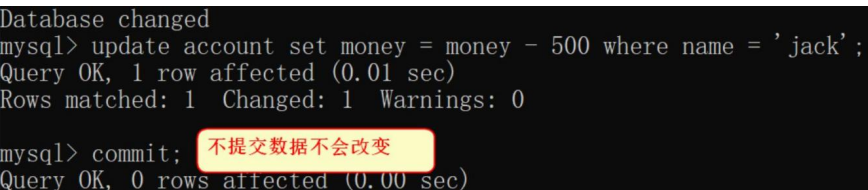 


## **3.4** ***事务的四大特性***ACID

| **特性** | **含义**                                                     |
| -------- | ------------------------------------------------------------ |
| 原子性   | 每个事务都是一个整体，不可再拆分，事务中所有的 SQL 语句要么都执行成功， 要么都失败。 |
| 一致性   | 事务在执行前数据库的状态与执行后数据库的状态保持一致。如：转账前2个人的 总金额是 2000，转账后 2 个人总金额也是 2000. |
| 隔离性   | 事务与事务之间不应该相互影响，执行时保持隔离的状态.          |
| 持久性   | 一旦事务执行成功，对数据库的修改是持久的。就算关机，数据也是要保存下来的. |

## **3.5** **MySQL** 事务隔离级别(了解)

#### **3.5.1** ***数据并发访问***

一个数据库可能拥有多个访问客户端,这些客户端都可以并发方式访问数据库. 数据库的相同数据可能被多个事务同时访问,如果不采取隔离措施,就会导致各种问题, 破坏数据的完整性

#### **3.5.2** ***并发访问会产生的问题***

事务在操作时的理想状态：  所有的事务之间保持隔离，互不影响。因为并发操作，多个用户同时访问同一个 数据。可能引发并发访问的问题

| 并发访问的问题 | **说明**                                                     |
| -------------- | ------------------------------------------------------------ |
| 脏读           | 一个事务读取到了另一个事务中尚未提交的数据                   |
| 不可重复读     | 一个事务中两次读取的数据内容不一致, 要求的是在一个事务中多次读取时数据是一致的. 这是进行 update 操作时引发的问题 |
| 幻读           | 一个事务中,某一次的 select 操作得到的结果所表征的数据状态, 无法支撑后续的业务操作. 查询得到的数据状态不准确,导致幻读.（插入一条数据时，表中没有，但是报错说已经存在） |

#### **3.5.3** 四种隔离级别

通过设置隔离级别,可以防止上面的三种并发问题.

MySQL数据库有四种隔离级别 上面的级别最低，下面的级别最高。

- ✔ 会出现问题

- ✘ 不会出现问题


| **级别** | **名字** | **隔离级别**     | **脏读** | 不可重复读 | **幻读** | 数据库的默认隔离级别    |
| -------- | -------- | ---------------- | -------- | ---------- | -------- | ----------------------- |
| 1        | 读未提交 | read uncommitted | ✔        | ✔          | ✔        |                         |
| 2        | 读已提交 | read committed   | ✘        | ✔          | ✔        | Oracle和SQLServer       |
| 3        | 可重复读 | repeatable read  | ✘        | ✘          | ✔        | MySql（默认的隔离级别） |
| 4        | 串行化   | serializable     | ✘        | ✘          | ✘        |                         |

从上到小，安全性越来越高，效率越来越低，根据不同的情况来选择隔离级别。

#### **3.5.4** 隔离级别相关命令

1查看隔离级别

```
select @@tx_isolation;
```

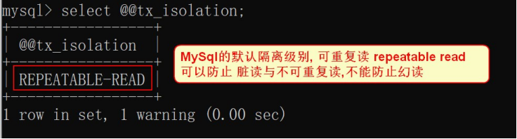 

2) 设置事务隔离级别，需要退出 MySQL 再重新登录才能看到隔离级别的变化

```
set global transaction isolation level 级别名称; 
read uncommitted 读未提交
read committed 读已提交
repeatable read 可重复读
serializable 串 行 化
```

例如: 修改隔离级别为 读未提交

```cmd
set global transaction isolation level read uncommitted;
```

## **3.6** ***隔离性问题演示***

### **3.6.1** ***脏读演示***

脏读: 一个事务读取到了另一个事务中尚未提交的数据

**1.** **打开窗口登录MySQL，设置全局的隔离级别为最低**

1) 登录是MySQL

2) 使用db_1 数据库

use db_1;

3) 设置隔离级别为最低读未提交

```
set global transaction isolation level read uncommitted;
```

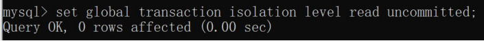 

**2. 关闭窗口,开一个新的窗口A,再次查询隔离级别**

1) **开启新的窗口A**

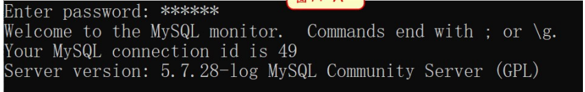

2**) 查询隔离级别**

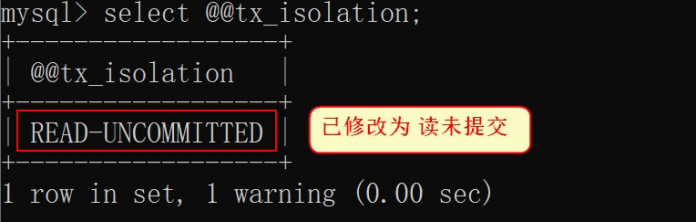 

**3. 再开启一个新的窗口B**

1) 登录数据库

2) 选择数据库

3) 开启事务

```mysql
start transaction;
```

4) 查询

```mysql
select * from account;
```

**1.** ***A窗口执行***

1) 选择数据库

2) 开启事务

3) 执行修改操作

```mysql
-- tom账户 -500元

UPDATE account SET money = money - 500 WHERE NAME = 'tom';

-- jack账户 + 500元

UPDATE account SET money = money + 500 WHERE NAME = 'jack';
```


**2.** **B窗口查询数据**

1) 查询账户信息

 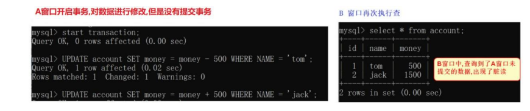

**3**. **A窗口转账异常进行回滚**

 

4. **B 窗口再次查询 账户**

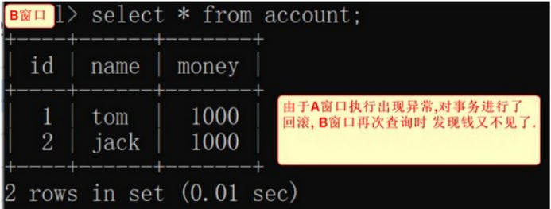

 

### **3.6.2** 解决脏读问题

脏读非常危险的，比如张三向李四购买商品，张三开启事务，向李四账号转入 500 块，然后打电话给李四说钱  已经转了。李四一查询钱到账了，发货给张三。张三收到货后回滚事务，李四的再查看钱没了。

解决方案

将全局的隔离级别进行提升为: read committed

1. 在 A 窗口设置全局的隔离级别为 read committed

   ```mysql
   set global transaction isolation level read committed;
   ```

2. 重新开启A窗口, 查看设置是否成功.

   ```mysql
   select @@tx_isolation;
   ```

 3.开启B 窗口, A 和 B 窗口选择数据库后, 都开启事务

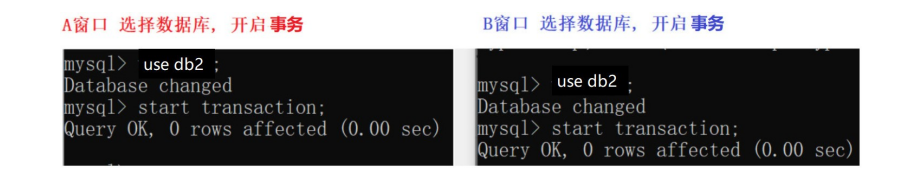

4. A 窗口 只是更新两个人的账户, 不提交事务

```mysql
-- tom账户 -500元
UPDATE account SET money = money - 500 WHERE NAME = 'tom';
-- jack账户 + 500元
UPDATE account SET money = money + 500 WHERE NAME = 'jack';
```

5. B 窗口进行查询,没有查询到未提交的数据

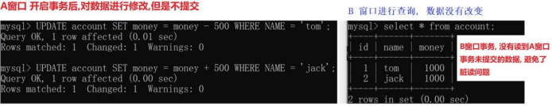 

6. A窗口commit提交数据

7. B 窗口查看数据

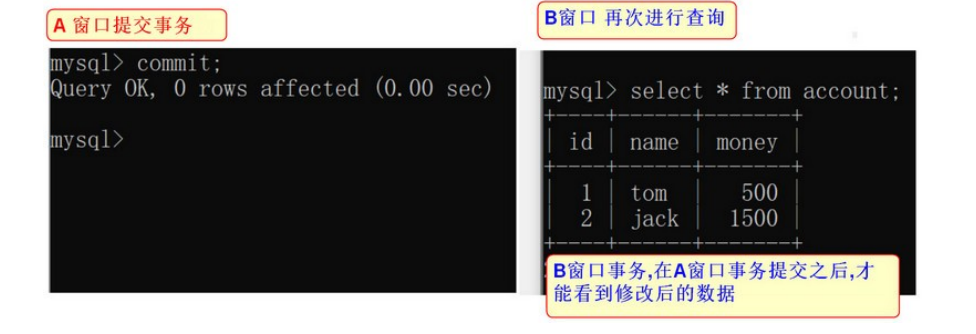

#### **3.6.3** 不可重复读演示

不可重复读: 同一个事务中,进行查询操作,但是每次读取的数据内容是不一样的

1. **恢复数据 (把数据改回初始状态)**

2. **打开两个 窗口A 和 窗口B,选择数据库后 开启事务**

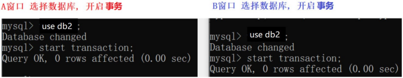 

1. **B 窗口开启事务后, 先进行一次数据查询**

 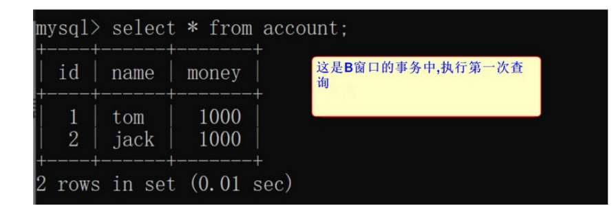

2. **在 A 窗口开启事务后，将用户tom的账户 + 500 ,然后提交事务**

```mysql
-- 修改数据
update account set money = money + 500 where name = 'tom';
-- 提交事务
commit;
```

1. **B 窗口再次查询数据**
2. 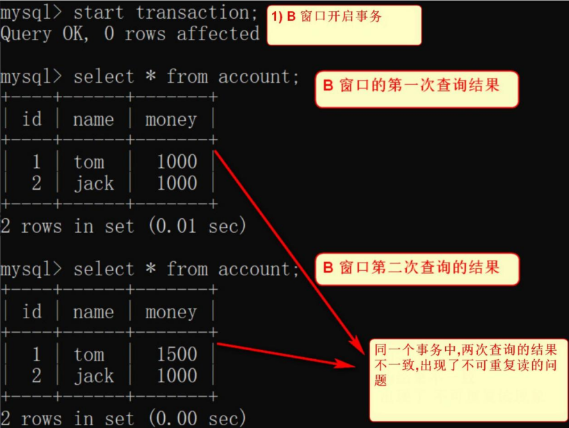

两次查询输出的结果不同，到底哪次是对的？

不知道以哪次为准。 

很多人认为这种情况就对了，无须困惑， 当然是后面的为准。

我们可以考虑这样一种情况:

比如银行程序需要将查询结果分别输出到电脑屏幕和发短信给客户，结果在一个事务中针对不同的输出目的地进行的两次查询不一致，导致文件和屏幕中的结果不一致，银 行工作人员就不知道以哪个为准了

### **3.6.4** 解决不可重复读问题

将全局的隔离级别进行提升为： repeatable read

1. 恢复数据

2. 打开A 窗口, 设置隔离级别为：repeatable read

```
-- 查看事务隔离级别
select @@tx_isolation;
-- 设置事务隔离级别为 repeatable read
set global transaction isolation level repeatable read;
```

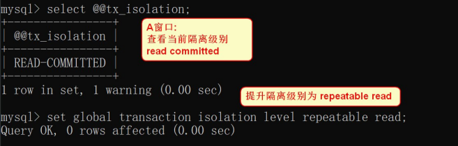 

3. 重新开启 A,B 窗口 选择数据库 ,同时开启事务

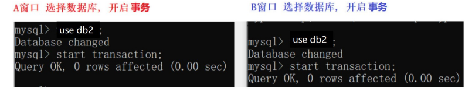

 

4. B 窗口事务 先进行第一次查询 

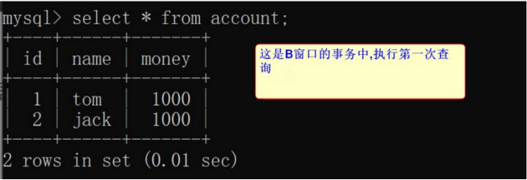 

5. A 窗口更新数据, 然后提交事务

6. B 窗口 再次查询

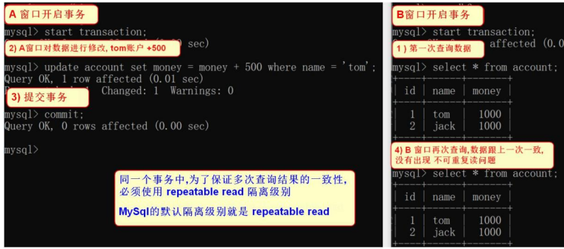

同一个事务中为了保证多次查询数据一致，必须使用 repeatable read 隔离级别

### **3.6.5** 幻读演示

幻读: select 某记录是否存在，不存在，准备插入此记录，但执行 insert 时发现此记录已存在， 无法插入，此时就发生了幻读。

1. **打开 A B 窗口, 选择数据库 开启事务**

   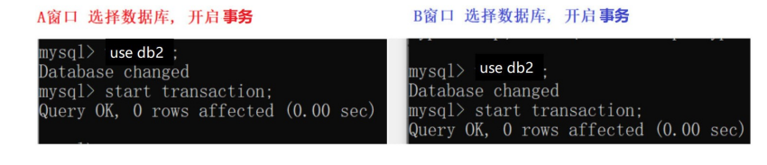

2. **A 窗口 先执行一次查询操作**

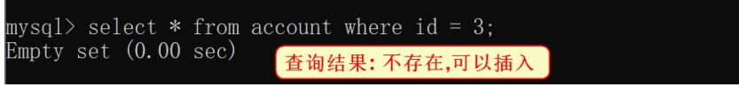 

3. **B 窗口 插入一条数据 提交事务**

   ```mysql
   INSERT INTO account VALUES(3,'lucy',1000);
   commit;
   ```

4. A 窗口执行 插入操作, 发现报错. 出现幻读

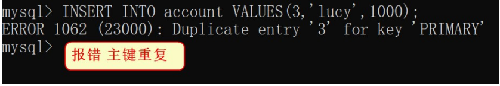

见鬼了，我刚才读到的结果应该可以支持我这样操作才对啊，为什么现在不可以

### **3.6.6** 解决幻读问题

将事务隔离级别设置到最高 SERIALIZABLE ，以挡住幻读的发生

如果一个事务，使用了SERIALIZABLE——可串行化隔离级别时，在这个事务没有被提交之前 , 其他的线程，只能等到当前操作完成之后，才能进行操作，这样会非常耗时，而且，影响数据库的 性能，数据库不会使用这种隔离级别

1. **恢复数据**

2. **打开A 窗口 将数据隔离级别提升到最高** 

3. **打开 A B 窗口, 选择数据库 开启事务**

 

4. **A 窗口 先执行一次查询操作**

   ```mysql
   SELECT * FROM account WHERE id = 3;
   ```

5. **B 窗口插入一条数据**

   ```mysql
   INSERT INTO account VALUES(3,'lucy',1000);
   commit;
   ```

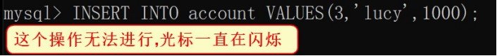 

6. **A 窗口执行 插入操作, 提交事务 数据插入成功.**

```
INSERT INTO account VALUES(3,'lucy',1000);
commit;
```

7. **B 窗口在 A窗口提交事务之后, 再执行,但是主键冲突出现错误**

总结:

serializable 串行化可以彻底解决幻读,但是 事务只能排队执行,严重影响效率, 数据库不会使用这种隔离级别