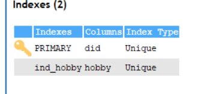
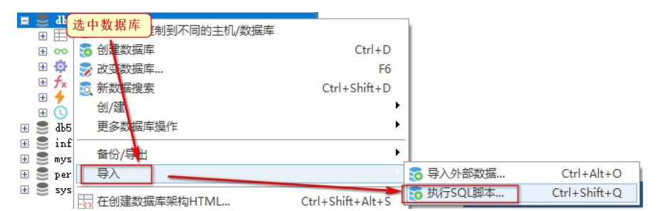
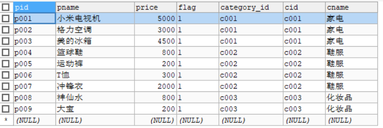
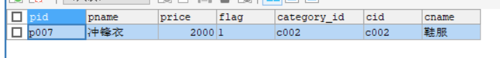

# MySQL索引&视图&存储过程

# 1.MySQL 索引

# **1.1** ***什么是索引***

在数据库表中，对字段建立索引可以大大提高查询速度。通过善用这些索引，可以令MySQL的查询和运行更加高效。

如果合理的设计且使用索引的MySQL是一辆兰博基尼的话，那么没有设计和使用索引的MySQL就是  一个人力三轮车。拿汉语字典的目录页（索引）打比方，我们可以按拼音、笔画、偏旁部首等排序的目  录（索引）快速查找到需要的字

# **1.2** ***常见索引分类***

| **索引名称**           | **说明**                                                     |
| ---------------------- | ------------------------------------------------------------ |
| 主键索引 (primary key) | 主键是一种唯一性索引,每个表只能有一个主键, 用于标识数据表中的每一条记录 |
| 唯一索引 (unique)      | 唯一索引指的是 索引列的所有值都只能出现一次, 必须唯一.       |
| 普通索引 (index)       | 最常见的索引,作用就是 加快对数据的访问速度                   |

**MySql**将一个表的索引都保存在同一个索引文件中如果对中数据进行增删改操作,MySql都会自动的更新索引


 


### 1.2.1 **主键索引** **(PRIMARY** **KEY)**

特点主键是一种唯一性索引每个表只能有一个主键用于标识数据表中的某一条记录。

一个表可以没有主键，但最多只能有一个主键，并且主键值不能包含NULL。

1) 创建db5数据库

```mysql
CREATE DATABASE db5 CHARACTER SET utf8;
```

2) 创建 demo01表

```mysql
CREATE TABLE demo01(
did INT,
dname VARCHAR(20),
hobby VARCHAR(30)
);
```

3) 语法格式

- 创建表的时候直接添加主键索引 (最常用)

```mysql
CREATE TABLE 表名(
-- 添加主键 (主键是唯一性索引,不能为null,不能重复,)
字段名 类型 PRIMARY KEY,
);
```

- 修改表结构 添加主键索引

```mysql
ALTER TABLE 表名 ADD PRIMARY KEY ( 列名 )
```

4) 为demo1 表添加主键索引

```mysql
ALTER TABLE demo01 ADD PRIMARY KEY(did);
```

### 1.2.2 唯一索引(UNIQUE)

特点:索引列的所有值都只能出现一次必须唯一

唯一索引可以保证数据记录的唯一性。事实上，在许多场合，人们创建唯一索引的目的往往不是为了  提高访问速度，而只是为了避免数据出现重复。

1) 语法格式

- 创建表的时候直接添加主键索引


```mysql
CREATE TABLE 表名(
列名 类型(长度),
-- 添加唯一索引
UNIQUE [索引名称] (列名)
);
```

- 使用create语句创建: 在已有的表上创建索引


```mysql
create unique index 索引名 on 表名(列名(长度))
```

- 修改表结构添加索引


```mysql
ALTER TABLE 表名 ADD UNIQUE ( 列名 )
```

2) 为 hobby字段添加唯一索引

```mysql
create unique index ind_hobby on demo01(hobby)
```



3) 向表中插入数据

```mysql
INSERT INTO demo01(did,dname,hobby) VALUES(1,'tom','篮球');
INSERT INTO demo01(did,dname,hobby) VALUES(2,'tom','篮球');
```


唯一索引保证了数据的唯一性，同时提升了查询的效率。

### 1.2.3 **普通索引** **(INDEX)**

普通索引（由关键字KEY或INDEX定义的索引）的唯一任务是加快对数据的访问速度。因此，应该只 为那些最经常出现在查询条件（WHERE column=）或排序条件（ORDERBY column）中的数据列创建索引。

1) 语法格式

使用create index 语句创建: 在已有的表上创建索引

```mysql
create index 索引名 on 表名(列名[长度])
```

修改表结构添加索引

```mysql
 ALTER TABLE 表名 ADD INDEX 索引名 (列名)
```

2) 给 dname字段添加索引

```mysql
 ALTER TABLE demo01 ADD INDEX ind_dname(dname);
```

### 1.2.4 **删除索引**

由于索引会占用一定的磁盘空间，因此，为了避免影响数据库的性能，应该及时删除不再使用的索  引

1) 语法格式

```mysql
ALTER	TABLE	table_name	DROP	INDEX	index_name;
```

2) 删除 demo01 表中名为 dname_indx 的普通索引。

```mysql
ALTER TABLE demo01 DROP INDEX ind_dname;
```

# **1.3** 索引性能测试

## **1.3.1** ***导入数据表***

1) 选中 db5数据库 右键 导入SQL脚本



2) 找到软件文件夹下的 测试索引.sql文件, 点击执行

3) 查询 test_index 表中的总记录数

```mysql
SELECT COUNT(*) FROM test_index;
```

表中有 500万条数据


## **1.3.2** ***测试***

1) 在没有添加索引的情况下, 使用 dname 字段进行查询

```mysql
#未添加索引,进行分组查询
SELECT * FROM test_index GROUP BY dname;
```

2) 耗时 


3) 为 dname字段 添加索引

```mysql
#添加索引
ALTER TABLE test_index ADD INDEX dname_indx(dname);
```

注意: 一般我们都是在创建表的时候 就确定需要添加索引的字段

4) 执行分组查询

```mysql
SELECT * FROM test_index GROUP BY dname;
```

# **1.4** ***索引的优缺点总结***

- 添加索引首先应考虑在 where 及 order by 涉及的列上建立索引。

​        索引的优点

1.  大大的提高查询速度

2.  可以显著的减少查询中分组和排序的时间.

   索引得缺点

1. 创建索引和维护索引需要时间，而且数据量越大时间越长

2. 当对表中的数据进行增加，修改，删除的时候，索引也要同时进行维护，降低了数据的维护速度

# 2.MySQL**视图**

## **2.1** ***什么是视图***

1. 视图是一种虚拟表。

2. 视图建立在已有表的基础上, 视图赖以建立的这些表称为基表。

3. 向视图提供数据内容的语句为 SELECT 语句, 可以将视图理解为存储起来的 SELECT 语句.

4. 视图向用户提供基表数据的另一种表现形式

## **2.2** ***视图的作用***

- 权限控制时可以使用


​           比如,某几个列可以运行用户查询,其他列不允许,可以开通视图 查询特定的列, 起到权限控制的作用

- 简化复杂的多表查询


​          视图 本身就是一条查询SQL,我们可以将一次复杂的查询 构建成一张视图, 用户只要查询视图就可以获取想要得到的信息(不需要再编写复杂的SQL)

​          视图主要就是为了简化多表的查询

## **2.3** ***视图的使用***

### **2.3.1** ***创建视图***

1) 语法格式 

```mysql
create view 视图名 [字段列表] as select语句;
view: 表示视图
column_list:  可选参数，表示属性清单，指定视图中各个属性的名称，默认情况下，与SELECT语句中查询的属性相同
as : 给视图提供查询语句
select语句: 向视图提供数据内容
```

2) 创建一张视图

```mysql
 
 -- 查询所有商品和商品对应分类的信息
SELECT * FROM products p LEFT JOIN category c ON p.`category_id` = c.`cid`;
 -- 根据上面的查询语句 构建一张视图
CREATE VIEW products_category_view 
AS SELECT * FROM products p LEFT JOIN category c ON p.`category_id` = c.`cid`;
```

3) 查询视图 ,当做一张只读的表操作就可以

```mysql
-- 操作视图 就相当于操作一张 只读表
SELECT * FROM products_category_view;
```

### 

### **2.3.2** ***通过视图进行查询***

1) 需求: 查询各个分类下的商品平均价格

```mysql
-- 多表查询
SELECT 
c.`cname`,
AVG(p.`price`)
FROM products p LEFT JOIN category c ON p.`category_id` = c.`cid`
GROUP BY c.`cname`;

-- 通过视图查询
SELECT 
	pc.`cname` '分类名称',
	AVG(pc.`price`) '平均价格'
FROM products_category_view pc GROUP BY pc.`cname`;
```

2) 需求: 查询鞋服分类下最贵的商品的全部信息

```mysql

/*先查鞋服中最高的价格*/
SELECT
MAX(price) AS maxPrice FROM
products p LEFT JOIN category c ON p.`category_id` = c.`cid` WHERE c.`cname` = '鞋服'

/*通过子查询 将上面的查询结果作为条件*/
SELECT * 
FROM products p LEFT JOIN category c ON p.`category_id` = c.`cid` 
WHERE c.`cname` = '鞋服' AND p.`price` = (SELECT MAX(price) AS maxPrice 
FROM
products p LEFT JOIN category c ON p.`category_id` = c.`cid` 
WHERE c.`cname` = '鞋服'
);

/*通过视图查询*/
SELECT * FROM products_category_view pcv WHERE	pcv.`cname` = '鞋服'
AND pcv.`price` = (SELECT MAX(price) FROM products_category_view WHERE cname = '鞋服')
```

 

## **2.4** ***视图与表的区别***

- 视图是建立在表的基础上，表存储数据库中的数据，而视图只是做一个数据的展示

- 通过视图不能改变表中数据（一般情况下视图中的数据都是表中的列 经过计算得到的结果,不允许更新）

- 删除视图，表不受影响，而删除表，视图不再起作用


# 3.MySQL **存储过程**(了解)

## **3.1** ***什么是存储过程***

- MySQL 5.0 版本开始支持存储过程。


- 存储过程（Stored Procedure）是一种在数据库中存储复杂程序，以便外部程序调用的一种数据库对象。存储过程是为了完成特定功能的SQL语句集，经编译创建并保存在数据库中，用户可通过 指定存储过程的名字并给定参数(需要时)来调用执行。


- 简单理解存储过程其实就是一堆SQL语句的合并。中间加入了一些逻辑控制。

## 3.2 **存储过程的优缺点**

- 优点:
  1. 调试完成就可以稳定的运行（在业务需求相对稳定情况）
  2. 存储过可以减少  业务系统与数据库的交互

- 缺点:
  1. 在互联网中 较少使用存储过程 ，因为业务需求变化太快
  2. 存储过程移植十分困难

## **3.3** ***存储过程的创建方式***

#### 3.3.1 **方式**1

1) 数据准备创建商品表 与 订单表

```mysql
# 商品表
CREATE TABLE goods(
gid INT,
NAME VARCHAR(20),
num INT	-- 库存
);

#订单表
CREATE TABLE orders( oid INT,
gid INT,
price INT -- 订单价格
);

# 向商品表中添加3条数据
INSERT INTO goods VALUES(1,'奶茶',20); 
INSERT INTO goods VALUES(2,'绿茶',100); 
INSERT INTO goods VALUES(3,'花茶',25);
```

2) 创建简单的存储过程语法格式

```mysql
DELIMITER $$	-- 声明语句结束符，可以自定义 一般使用
$$ CREATE PROCEDURE 过程名称()	-- 声明存储过程
BEGIN	-- 开始编写存储过程
-- 要执行的操作
END $$	-- 存储过程结束
```

需求: 编写存储过程, 查询所有商品数据 并进行调用

```mysql
-- 编写存储过程, 查询所有商品数据
DELIMITER $$
CREATE PROCEDURE goods_proc()
BEGIN
 SELECT * FROM goods;
END $$

-- 调用存储过程 call
CALL goods_proc;
```

注意：这里为什么要定义结束符号，是因为我们默认的是以分号结尾，但是在SQL语句中已经有了分号，避免报错我们这里自定义结束符号。

#### 3.3.2 **方式**2

1) IN 输入参数：表示调用者向存储过程传入值

```mysql
CREATE PROCEDURE 存储过程名称(IN 参数名 参数类型)
```

2) 创建接收参数的存储过程

需求: 接收一个商品id, 根据id删除数据

```mysql
-- 接收一个商品id, 根据id删除数据
DELIMITER $$
CREATE PROCEDURE goods_proc02(IN goods_id INT)
BEGIN
-- 根据ID删除商品数据
DELETE  FROM goods WHERE gid = goods_id;
END $$
-- 调用存储过程
CALL goods_proc02(1);
```

#### 3.3.3 **方式**3

1) 变量赋值

```mysql
SET @变量名=值
```

2) OUT 输出参数：表示存储过程向调用者传出值

```mysql
OUT 变量名 数据类型
```

3) 创建存储过程

需求: 向订单表 插入一条数据, 返回1,表示插入成功

```mysql
# 创建存储过程 接收参数插入数据, 并返回受影响的行数
DELIMITER $$
CREATE PROCEDURE orders_proc(IN o_oid INT , IN o_gid INT ,IN o_price INT, OUT out_num INT)
BEGIN
-- 执行插入操作
INSERT INTO orders VALUES(o_oid,o_gid,o_price);
-- 设置 num的值为 1 SET @out_num = 1;
-- 返回 out_num的值SELECT @out_num;
END $$
```

4) 调用存储过程

```mysql
# 调用存储过程插入数据,获取返回值
CALL orders_proc(1,2,30,@out_num);
```

# 4.MySQL触发器(了解)

## **4.1** 什么是触发器

触发器（trigger）是MySQL提供给程序员和数据分析员来保证数据完整性的一种方法，它是与表事件相关的特殊的存储过程，它的执行不是由程序调用，也不是手工启动，而是由事件来触发，比如当对  一个表进行操作（insert，delete， update）时就会激活它执行。——百度百科

**简单理解当我们执行一条sql语句的时候，这条sql语句的执行会自动去触发执行其他的sql语句。**

## **4.2** 触发器创建的四个要素

1. 监视地点（table）

2. 监视事件（insert/update/delete）

3. 触发时间（before/after）

4. 触发事件（insert/update/delete）

## **4.3** 创建触发器

1) 语法格式


2) 向商品中添加一条数据


 

3) 需求: 在下订单的时候，对应的商品的库存量要相应的减少，卖出商品之后减少库存量。编写触发器


 

4) 查询 goods表中的数据


5) 向订单表中添加一条数据


 

6) goods表中的数据随之 -1


 

# 5.DCL(数据控制语言)

MySql默认使用的都是  root  用户，超级管理员，拥有全部的权限。除了root用户以外，我们还可以通过DCL语言来定义一些权限较小的用户, 分配不同的权限来管理和维护数据库。

## **5.1** 创建用户

语法格式


 


 

| **参数** | **说明**                                                     |
| -------- | ------------------------------------------------------------ |
| 用户名   | 创建的新用户,登录名称                                        |
| 主机名   | 指定该用户在哪个主机上可以登陆，本地用户可用 localhost如果想让该用户可以 从任意远程主机登陆，可以使用通配符 % |
| 密码     | 登录密码                                                     |

 

1) 创建 admin1 用户，只能在 localhost 这个服务器登录 mysql 服务器，密码为 123456


 


 

- 创建的用户在名字为 mysql的 数据库中的 user表中


 


 

2) 创建 admin2 用户可以在任何电脑上登录 mysql 服务器，密码为 123456


 


 

% 表示 用户可以在任意电脑登录 mysql服务器.

## **5.2** 用户授权

创建好的用户,需要进行授权


语法格式


|      |                                                              |
| ---- | ------------------------------------------------------------ |
|      |  |

 


 

| **参数** | **说明**                                                     |
| -------- | ------------------------------------------------------------ |
| 权限     | 授予用户的权限，如 CREATE、ALTER、SELECT、INSERT、UPDATE 等。如果要授 予所有的权限则使用 ALL |
| ON       | 用来指定权限针对哪些库和表。                                 |
| TO       | 表示将权限赋予某个用户。                                     |

 

1) 给 admin1 用户分配对 db4 数据库中 products 表的 操作权限：查询


 


 

2) 给 admin2 用户分配所有权限，对所有数据库的所有表


3) 使用admin1用户登录数据库 测试权限


4) 发现数据库列表中 只有db4, 表只有 products.


5) 执行查询操作


 

6) 执行插入操作,发现不允许执行,没有权限


 

## **5.3** 查看权限


语法格式


 


 

1) 查看root用户权限

 


 


GRANT ALL PRIVILEGES 是表示所有权限


## **5.4** 删除用户

语法格式


1) 删除 admin1 用户


 


 

## **5.5** 查询用户

选择名为 mysql的数据库, 直接查询 user表即可


 


# 6.数据库备份&还原


备份的应用场景  在服务器进行数据传输、数据存储和数据交换，就有可能产生数据故障。比如发生意外停机或存储介质损坏。  这时，如果没有采取数据备份和数据恢复手段与措施，就会导致数据的丢失，造成的损失是无法弥补与估量的。

## 6.1 **SQLYog** **数据备份**

1) 选中要备份的数据库,右键 备份导出	>选择 备份数据库 

 

2) 指定文件位置,选择导出即可


## 6.2 **SQLYog** **数据恢复**

1) 先删除 db2 数据库


 


 

2) 导入 之前备份的 SQL 文件

 


 


 

## **6.3** 命令行备份

进入到Mysql安装目录的 bin目录下, 打开DOS命令行.

1) 语法格式


 

2) 执行备份, 备份db2中的数据 到 H盘的 db2.sql 文件中


## **6.4** 命令行恢复

1) 先删除 db2 数据库


2) 恢复数据 还原 db2 数据库中的数据

注意：还原的时候需要先创建一个db2数据库

 


 