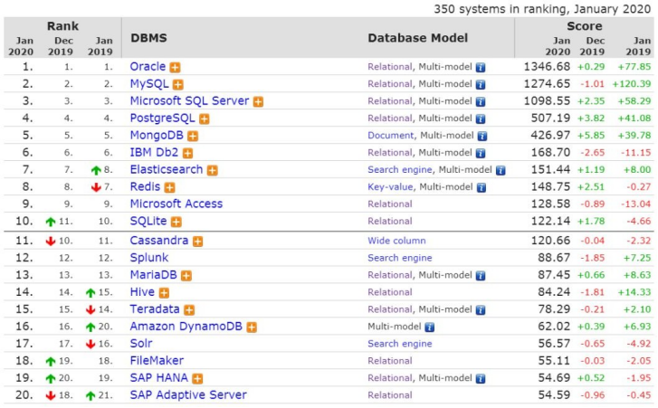
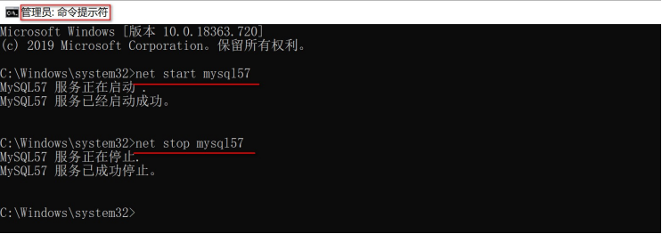
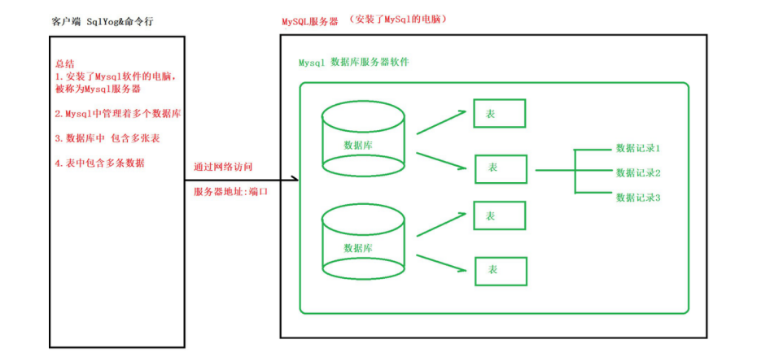
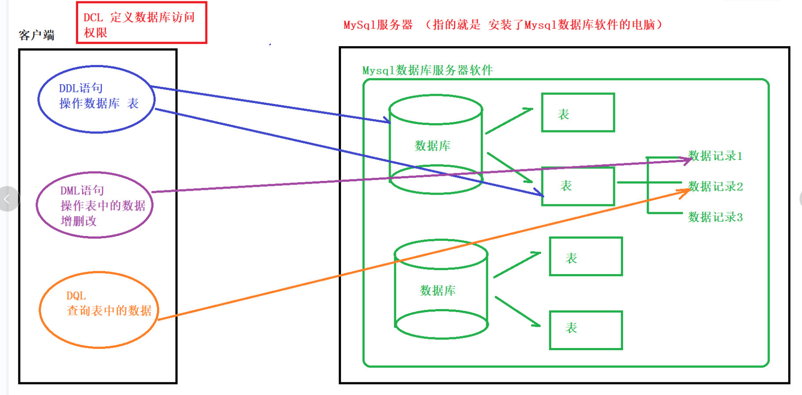
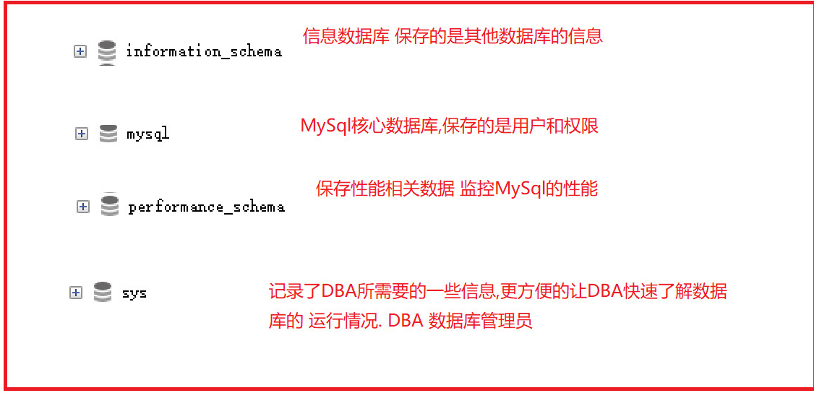
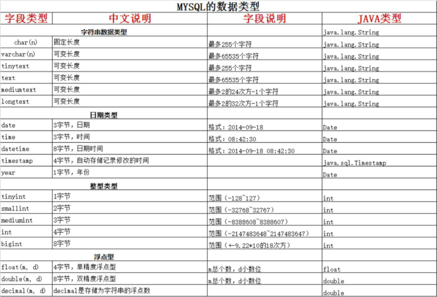

# MySQL基础&SQL入门

# **1.** ***数据库的基本概念***

## **1.1** ***什么是数据库***

1. 数据库(DataBase) 就是**存储**和**管理**数据的仓库

2. 其本质是一个文件系统, 还是以文件的方式,将数据保存在电脑上

## **1.2** ***为什么使用数据库***

数据存储方式的比较

| **存储方式** | **优点**                                                     | **缺点**                                      |
| ------------ | ------------------------------------------------------------ | --------------------------------------------- |
| 内存         | 速度快                                                       | 不能够永久保存,数据是临时状态的               |
| 文件         | 数据是可以永久保存的                                         | 使用IO流操作文件, 不方便                      |
| 数据库       | 1. 数据可以永久保存2. 方便存储和管理数据3. 使用统一的方式操作数据库(SQL) | 占用资源,有些数据库需要付费(比如Oracle数据库) |

通过上面的比较我们可以看出使用数据库存储数据，用户可以非常方便对数据库中的数据进行增加删除修改及查询操作。

## **1.3** **常见的数据库软件排行榜**

**2020**年数据库排行

 

开发中常见的数据库

| **数据库名**      | **介绍**                                                     |
| ----------------- | ------------------------------------------------------------ |
| **MySql**数据库** | 开源免费的数据库因为免费开源、运作简单的特点，常作为中小型的项目的数据库首选。MySQL1996年开始运作，目前已经被Oracle公司收购了. MySQL6.x开始收费 |
| Oracle数据库      | 收费的大型数据库，Oracle公司的核心产品。安全性高             |
| DB2               | IBM公司的数据库产品,收费的超大型数据库。常在银行系统中使用   |
| SQL Server        | MicroSoft 微软公司收费的中型的数据库。C#、.net等语言常使用。但该数据库只能运行在windows机器上，扩展性、稳定性、安全性、性能都表现平平。 |

为什么选择MySQL ?

1. 功能强大,足以应付web应用开发

2. 开源, 免费

# **2.** ***MySQL******的安装及配置***

## **2.1** ***安装******MySQL***

- 详见 MySQL安装文档

## **2.2** ***卸载******MySQL***

- 详见 MySQL卸载文档

## **2.3** ***MySQL******环境变量配置***

- 详见 MySQL环境变量配置文档

## **2.4** ***MySQL******的启动与关闭***

### **2.4.1** MySQL

1) 右键此电脑 --> 管理

2) 选择服务--> 找到MysQL服务

3) 右键选择 --> 启动或停止 

### **2.4.2** ***方式二******:*** ***DOS*****命令方式启动**

1) 首先以管理员身份 打开命令行窗口


2) 启动MySql

net start mysql57 

3) 关闭MySql

net stop mysql57 

 

## **2.5** ***命令行登录数据库***

MySQL是一个需要账户名密码登录的数据库，登陆后使用，它提供了一个默认的root账号，使用安装时设置的密码即可登录。

| **命令**                          | **说明**                                          |
| --------------------------------- | ------------------------------------------------- |
| mysql -u 用户名 -p 密码           | 使用指定用户名和密码登录当前计算机中的MySQL数据库 |
| mysql -h 主机IP -u 用户名 -p 密码 | -h 指定IP 方式,进行 登录                          |

命令演示:

```
mysql -uroot -p123456 

mysql -h127.0.0.1 -uroot -p123456
```

退出命令

```
exit 或者 quit
```

## **2.6** ***SqlYog******的使用***

1) 简介

SQLyog是业界著名的Webyog公司出品的一款简洁高效、功能强大的图形化MySQL数据库管理工   具。使用 SQLyog 可以快速直观地让您从世界的任何角落通过网络来维护远端的 MySQL 数据库

2) 具体安装教程 请查看

SQLyog安装教程

## **2.7** ***MySql******的目录结构***

1) MySQL安装目录

MySql的默认安装目录在 C:\Program Files\MySQL\MySQL Server 5.7

| **目录** | **目录内容**                 |
| -------- | ---------------------------- |
| bin      | 放置一些可执行文件           |
| docs     | 文档                         |
| include  | 包含(头)文件                 |
| lib      | 依赖库                       |
| share    | 用于存放字符集、语言等信息。 |

2) 

MySQL配置文件 与 数据库及 数据表所在目录


my.ini 文件 是 mysql 的配置文件，一般不建议去修改

 


data<目录> Mysql管理的数据库文件所在的目录

 

几个概念

数据库： 文件夹

表： 文件

数据： 文件中的记录

 

## **2.8** ***数据库管理系统***

1) 什么是数据库管理系统 ?

数据库管理系统（DataBase Management System，DBMS）：指一种操作和管理维护数据库的大型软件。

MySQL就是一个 数据库管理系统软件, 安装了Mysql的电脑,我们叫它数据库服务器.

2) 数据库管理系统的作用

用于建立、使用和维护数据库，对数据库进行统一的管理。

3）数据库管理系统、数据库 和表之间的关系

MySQL中管理着很多数据库，在实际开发环境中 一个数据库一般对应了一个的应用，数据库当中保存着多张表，每一张表对应着不同的业务，表中保存着对应业务的数据。

 


## **2.9** ***数据库表***

- 数据库中以表为组织单位存储数据
- 表类似我们Java中的类,每个字段都有对应的数据类型

那么我们使用熟悉的Java程序来与关系型数据对比,就会发现以下关系:

```
类 -----> 表
类中属性 ----> 表中字段
对象	--->	数据记录
```

# **3.** ***SQL(******重点******)***

## **3.1** ***SQL******的概念***

1） 什么是SQL ？

结构化查询语言(Structured Query Language)简称SQL，是一种特殊目的的编程语言，是一种数据库查询和程序设计语言，用于存取数据以及查询、更新和管理关系数据库系统。

2） SQL 的作用

是所有关系型数据库的统一查询规范，不同的关系型数据库都支持SQL 

所有的关系型数据库都可以使用SQL

不同数据库之间的SQL 有一些区别方言

## **3.2** ***SQL******通用语法***

1） SQL语句可以单行 或者 多行书写，以分号 结尾 ; （Sqlyog中可以不用写分号）

2） 可以使用空格和缩进来增加语句的可读性。

3） MySql中使用SQL不区分大小写，一般关键字大写，数据库名 表名列名 小写。

4） 注释方式

| **注释语法** | **说明**            |
| ------------ | ------------------- |
| -- 空格      | 单行注释            |
| /* */        | 多行注释            |
| #            | MySql特有的单行注释 |

```
# show databases;	单行注释
-- show databases; 单行注释
/*
多行注释
show databases;
*/
```

## **3.3** ***SQL******的分类***

| **分类**     | **说明**                                                     |
| ------------ | ------------------------------------------------------------ |
| 数据定义语言 | 简称DDL(Data Definition Language)，用来定义数据库对象：数据库，表，列等。 |
| 数据操作语言 | 简称DML(Data Manipulation Language)，用来对数据库中表的记录进行更新。 |
| 数据查询语言 | 简称DQL(Data Query Language)，用来查询数据库中表的记录。     |
| 数据控制语言 | 简称DCL(Date Control Language)，用来定义数据库的访问权限和安全级别， 及创建用户。(了解) |

注： 我们重点学习 DML 与 DQL！

 

```mysql
/*
	对数据库的操作分类包含 CRUD
	C：create  创建
	R：retrieve 查询
	U:update    修改
	D：delete    删除
	使用数据库
*/
```

## **3.4** ***DDL******操作 数据库***

### **3.4.1** **创建数据库**

| **命令**                                       | **说明**                                                |
| ---------------------------------------------- | ------------------------------------------------------- |
| create database 数据库名；                     | 创建指定名称的数据库。                                  |
| create database 数据库名 character set字符集； | 创建指定名称的数据库，并且指定字符集（一般都指定utf-8） |

代码示例

```mysql
/*
	创建数据库 方式一：指定名称的数据库    会出现乱码
*/
CREATE DATABASE db1;
```

```mysql
/*
	指定字符集的方式创建数据库
*/
CREATE DATABASE db_1 CHARACTER SET utf8;
```

### **3.4.2** ***查看选择数据库***

| **命令**                        | **说明**                   |
| ------------------------------- | -------------------------- |
| use 数据库                      | 切换数据库                 |
| select database();              | 查看当前正在使用的数据库   |
| show databases;                 | 查看Mysql中 都有哪些数据库 |
| show create database 数据库名； | 查看一个数据库的定义信息   |

代码示例

```mysql
-- 切换数据库 从db1 切换到 db1_1 USE db1_1;

-- 查看当前正在使用的数据库
SELECT DATABASE();

-- 查看Mysql中有哪些数据库
SHOW DATABASES;

-- 查看一个数据库的定义信息
SHOW CREATE DATABASE db1_1;
```

Sql中的其他数据库：




### 3.4.3修改数据库

修改数据库字符集

| **命令**                                       | **说明**               |
| ---------------------------------------------- | ---------------------- |
| alter database 数据库名 character set 字符集； | 数据库的字符集修改操作 |

### **3.4.4** ***删除数据库***

 

| **命令**               | **说明**                      |
| ---------------------- | ----------------------------- |
| drop database 数据库名 | 从MySql中永久的删除某个数据库 |

代码示例

```mysql
--修改数据库的字符集
--语法格式为alter DATABASE 数据库名  CHARACTER SET utf8

ALTER DATABASE db1 CHARACTER SET utf8

--查询当前数据库的基本信息
SHOW CREATE DATABASE db1;

--删除数据库
--语法格式 DROP DATABASE 数据库名称   将数据库从MySql中永久删除
DROP DATABASE db1    要慎用
```


## **3.5** 操作数据表

### **3.5.1** ***MySQL******常见的数据类型***

1） 常用的数据类型：

| **类型** | **描述**                                            |
| -------- | --------------------------------------------------- |
| int      | 整型                                                |
| double   | 浮点型                                              |
| varchar  | 字符串型                                            |
| date     | 日期类型，给是为 yyyy-MM-dd ,只有年月日，没有时分秒 |

2） 

详细的数据类型（了解即可）



 

注意：

MySQL中的 char类型与 varchar类型，都对应了 Java中的字符串类型，区别在于： 

- char类型是固定长度的： 根据定义的字符串长度分配足够的空间。 也就是你创建了多少长度，创建时就用多少

- varchar类型是可变长度的： 只使用字符串长度所需的空间


比如：保存字符串 "abc"

```
x      char(10) 占用10个字节
y      varchar(10) 占用3个字节
```

适用场景：

- char类型适合存储 固定长度的字符串，比如 密码 ，性别一类

- varchar类型适合存储 在一定范围内，有长度变化的字符串


### **3.5.2** ***创建表***

语法格式：

```
创建表的语法格式
		create table (
		  字段名称 字段类型（长度）
		  字段名称2 字段类型，
		  字段名称3 字段类型      最后一个字段不要加逗号
		);
```

- 需求1： 创建商品分类表


```
表名：category 表中字段：

分类ID ：cid ,为整型

分类名称：cname，为字符串类型，指定长度20
```

SQL实现 

```mysql
CREATE TABLE category(
	cid INT,
	cname VARCHAR(20)

);
```

- 需求2： 创建测试表


```
表名： test1

表中字段：

测试ID ： tid ,为整型

测试时间： tdate , 为年月日的日期类型 
```

SQL实现

```mysql

CREATE TABLE test1(
	tis INT,
	tdate DATE

);
```

- 需求3： 快速创建一个表结构相同的表（复制表结构） 语法格式:


```
-- 快速创建一个表结构相同的表（复制表结构）
--语法结构  CREATE TABLE 新的表名称 LIKE 旧表名称
```

代码示例

```mysql
--创建一个和test1表结构相同的test2表
CREATE TABLE test2 LIKE test1
```

### **3.5.3** ***查看表***

| **命令**     | **说明**                   |
| ------------ | -------------------------- |
| show tables; | 查看当前数据库中的所有表名 |
| desc 表名；  | 查看数据表的结构           |

代码示例

查看数据表的结构

```mysql
DESC test1;
```

 查看当前数据库中的所有表名

```mysql
SHOW TABLES
```

查看表的Sql

```mysql
SHOW CREATE TABLE category
```


### **3.5.4** ***删除表***

| **命令**                    | **说明**                                           |
| --------------------------- | -------------------------------------------------- |
| drop table 表名；           | 删除表（从数据库中永久删除某一张表）               |
| drop table if exists 表名； | 判断表是否存在， 存在的话就删除,不存在就不执行删除 |

代码示例

 从数据库中永久的删除表

```mysql
DROP TABLE test1; //删除test1表
```

判断表的是否存在，如果存在就删除，不存在就不执行删除

```mysql
DROP TABLE IF EXITS test3; //使用先判断再删除
```

### **3.5.5** ***修改表***

1）修改表名语法格式

rename table 旧表名称 to 新表名称;

需求： 将category表 改为 category1

```mysql
RENAME TABLE category TO categorys
```

2) 修改表的字符集语法格式

alter table 表名 character set 字符集

需求: 将category表的字符集 修改为gbk

```mysql
 ALTER TABLE categorys CHARACTER  SET gbk;
```

3） 向表中添加列， 关键字语法格式：

alter table 表名 add 字段的名称 字段类型（长度）

需求： 为分类表添加一个新的字段为 分类描述 cdesc varchar(20)

```mysql
ALTER TABLE categorys ADD eadesc VARCHAR(20);
```

4） 修改表中列的数据类型或长度 ， 关键字语法格式：

alter table 表名 modify 字段名称  字段类型

需求：对分类表的描述字段进行修改，类型varchar(50)

```mysql
ALTER TABLE categorys MODIFY eadesc VARCHAR(50);//修改字段长度
ALTER TABLE categorys MODIFY eadesc CHAR(20);  //修改字段类型
```

5） 修改列名称 , 关键字语法格式

 alter table 表名  change 旧列名 新列名 类型（长度）

需求: 对分类表中的 desc字段进行更换, 更换为 description varchar(30)

```mysql
ALTER TABLE categorys CHANGE eadesc description VARCHAR(30)
```

6） 删除列 ，关键字语法格式

alter table 表名 drop 列名

需求： 删除分类表中description这列

```mysql
ALTER TABLE categorys DROP description
```

## **3.6** ***DML*** ***操作表中数据***

SQL中的DML 用于对表中的数据进行增删改操作

### **3.6.1** ***插入数据***

语法格式：

 insert into 表名 （字段名。。。。） values (设置字段的值)

1） 代码准备，创建一个学生表：

```mysql
CREATE TABLE student(
cid INT, 
cname VARCHAR(20),
csex CHAR(1),
caddress VARCHAR(40)
);
```

2） 向 学生表中添加数据，3种方式

方式1： 插入全部字段， 将所有字段名都写出来

```mysql
 INSERT INTO student (cid,cname,csex,caddress) VALUES(1,'孙悟空','男','花果山');
```

方式2： 插入全部字段，不写字段名

```mysql
INSERT INTO student VALUES(2,'崔巍','女','盂县');
```

方式3：插入指定字段的值

```mysql
 INSERT INTO student (cid,cname) VALUES(3,'大头');
```

注意：

1) 值与字段必须要对应，个数相同&数据类型相同

2） 值的数据大小，必须在字段指定的长度范围内

3） varchar char date类型的值必须使用单引号，或者双引号 包裹。

4） 如果要插入空值，可以忽略不写，或者插入null

5) 如果插入指定字段的值，必须要上写列名

### **3.6.2** ***更改数据***

语法格式1：不带条件的修改

 update  表名 set 列名 = 值


 

语法格式2：带条件的修改

 update 表名 set  列名 = 值 【where] 条件表达式：字段名 = 值】

1） 不带条件修改，将所有的性别改为女（慎用！！）

```mysql
update student set sex = '女'；
```

2） 带条件的修改，将sid 为3的学生，性别改为男

```mysql
update student set sex = '男' where cid = 1; 
```

3） 一次修改多个列， 将sid为 2 的学员，年龄改为 20，地址改为 北京

```mysql
update student set cname = '大头',address = '北京'   where cid = 3;
```

### **3.6.3** ***删除数据***

语法格式1：删除所有数据

delete from 表名

语法格式2： 指定条件 删除数据

delete from 表名 【where 条件】；

 

1）删除 sid 为 1 的数据

```mysql
delete  from student where cid = 1;
```


2) 删除所有数据

```mysql
delete from student;
```

3) 如果要删除表中的所有数据,有两种做法

1. delete from 表名; 不推荐. 有多少条记录 就执行多少次删除操作. 效率低

2. truncate table 表名: 推荐. 先删除整张表, 然后再重新创建一张一模一样的表. 效率高

## **3.7** ***DQL*** ***查询表中数据***

### **3.7.1** ***准备数据***

 

\#创建员工表表名 emp 表中字段：

eid 员 工 id，int

 ename 姓名，varchar 

sex 性 别 ，char 

salary 薪资，double

hire_date 入职时间，date 

dept_name 部门名称，varchar

```mysql
#创建员工表

CREATE TABLE emp(

eid INT,

ename VARCHAR(20), 

sex CHAR(1),

salary DOUBLE, 

hire_date DATE, 

dept_name VARCHAR(20)

);
```

 

\#添加数据

```mysql
INSERT INTO emp VALUES(1,'孙悟空','男',7200,'2013-02-04','教学部');

INSERT INTO emp VALUES(2,'猪八戒','男',3600,'2010-12-02','教学部');

INSERT INTO emp VALUES(3,'唐僧','男',9000,'2008-08-08','教学部');

INSERT INTO emp VALUES(4,'白骨精','女',5000,'2015-10-07','市场部');

INSERT INTO emp VALUES(5,'蜘蛛精','女',5000,'2011-03-14','市场部');

INSERT INTO emp VALUES(6,'玉兔精','女',200,'2000-03-14','市场部');

INSERT INTO emp VALUES(7,'林黛玉','女',10000,'2019-10-07','财务部');

INSERT INTO emp VALUES(8,'黄蓉','女',3500,'2011-09-14','财务部'); 

INSERT INTO emp VALUES(9,'吴承恩','男',20000,'2000-03-14',NULL); 

INSERT INTO emp VALUES(10,'孙悟饭','男', 10,'2020-03-14','财务部');
```

 

### **3.7.2** ***简单查询***

查询不会对数据库中的数据进行修改.只是一种显示数据的方式 SELECT

语法格式

 selete 列名 from 表名

需求1： 查询emp中的 所有数据

```mysql

SELECT * FROM emp;
```

需求2： 查询emp表中的所有记录，仅显示id和name字段


```mysql
SELECT eid,ename FROM emp; 
```

需求3： 将所有的员工信息查询出来，并将列名改为中文别名查询，使用关键字

```mysql
SELECT
eid AS ' 编 号 ', 
ename AS '姓名' , 
sex AS ' 性 别 ', 
salary AS '薪资',
hire_date '入职时间',
 -- AS 可以省略
dept_name '部门名称' 
FROM emp;
```


需求4：查询一共有几个部门使用去重关键字

```mysql
SELECT DISTINCT dept_name FROM emp; 
```

 distinct可以去除重复的数据

需求5: 将所有员工的工资 +1000 元进行显示运算查询 (查询结果参与运算)

```mysql
 SELECT salary+1000 FROM emp;
 SELECT salary +1000 AS salary FROM emp;
```

### **3.7.3** ***条件查询***

如果查询语句中没有设置条件就会查询所有的行信息

在实际应用中一定要指定查询条件对记录进行过滤

语法格式

select  列名    from   表名   where    条件表达式

#### ***运算符***

1) 比较运算符

| **运算符**        | **说明**                                                     |
| ----------------- | ------------------------------------------------------------ |
| > < <= >= = <> != | 大于、小于、大于(小于)等于、不等于                           |
| BETWEEN ...AND... | 显示在某一区间的值例如: 2000-10000之间： Between 2000 and 10000 |
| IN(集合)          | 集合表示多个值,使用逗号分隔,例如: name in (悟空，八戒) in中的每个数据都会作为一次条件,只要满足条件就会显示 |
| LIKE '%张%'       | 模糊查询                                                     |
| IS NULL           | 查询某一列为NULL的值, 注: 不能写 = NULL                      |

2) 逻辑运算符

| **运算符** | **说明**         |
| ---------- | ---------------- |
| And &&     | 多个条件同时成立 |
| Or \|\|    | 多个条件任一成立 |
| Not        | 不成立，取反。   |

需求1:

```
# 查询员工姓名为黄蓉的员工信息
# 查询薪水价格为5000的员工信息
# 查询薪水价格不是5000的所有员工信息
# 查询薪水价格大于6000元的所有员工信息
# 查询薪水价格在5000到10000之间所有员工信息
# 查询薪水价格是3600或7200或者20000的所有员工信息
```

代码实现

```mysql
# 查询员工姓名为黄蓉的员工信息
SELECT * FROM emp WHERE ename = '黄蓉';
# 查询薪水价格为5000的员工信息
SELECT * FROM emp WHERE salary=5000;
# 查询薪水价格不是5000的所有员工信息
SELECT * FROM emp WHERE salary!=5000;
# 查询薪水价格大于6000元的所有员工信息
SELECT * FROM emp WHERE salary >6000;
# 查询薪水价格在5000到10000之间所有员工信息
SELECT * FROM emp WHERE salary BETWEEN 5000 AND 10000;
# 查询薪水价格是3600或7200或者20000的所有员工信息
SELECT * FROM emp WHERE salary =3600 OR salary =7200 OR salary = 20000;
SELECT * FROM emp WHERE salary IN(3600,7200,20000);
```

需求2:

```
# 查询含有'精'字的所有员工信息
# 查询以'孙'开头的所有员工信息
# 查询第二个字为'兔'的所有员工信息
# 查询没有部门的员工信息
# 查询有部门的员工信息
```

 

``` mysql
# 查询含有'精'字的所有员工信息
SELECT * FROM emp WHERE ename LIKE '%精%'
# 查询以'孙'开头的所有员工信息
SELECT * FROM emp WHERE ename LIKE '孙%'
# 查询第二个字为'兔'的所有员工信息
SELECT * FROM emp WHERE ename LIKE '_兔%'
# 查询没有部门的员工信息
SELECT * FROM emp WHERE dept_name IS NULL;
# 查询有部门的员工信息
SELECT * FROM emp WHERE dept_name IS NOT NULL;
```

模糊查询 通配符

| **通配符** | **说明**                |
| ---------- | ----------------------- |
| %          | 表示匹配任意多个字符串, |
| _          | 表示匹配 一个字符       |


 