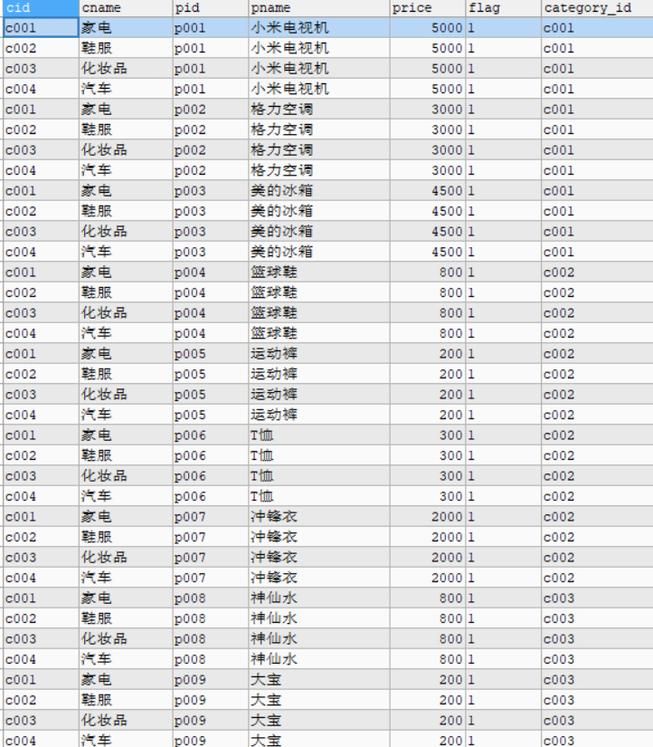
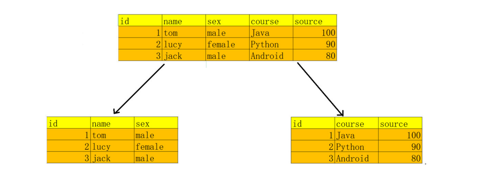

# MySQL多表&外键&数据库设计

# **1.** ***多表***

## **1.1** ***多表简述***

实际开发中，一个项目通常需要很多张表才能完成。

例如一个商城项目的数据库,需要有很多张表：用户表、分类表、商品表、订单表....

## **1.2** ***单表的缺点***

### **1.2.1** ***数据准备***

1) 创建一个数据库 db3

2) 数据库中 创建一个员工表 emp ,

1) 包 含 如 下 列 eid, ename, age, dept_name, dept_location

2) eid 为主键并自动增长, 添加 5 条数据

```mysql
CREATE TABLE emp(
   eid INT PRIMARY KEY AUTO_INCREMENT,
   ename VARCHAR(20),
   age INT,
   dept_name VARCHAR(20),
   dept_location VARCHAR(20)
);
```

```mysql
-- 添加数据
INSERT INTO emp (ename, age, dep_name, dep_location) VALUES ('张百万', 20, '研发部', '广州');
INSERT INTO emp (ename, age, dep_name, dep_location) VALUES ('赵四', 21, '研发部', '广州');
INSERT INTO emp (ename, age, dep_name, dep_location) VALUES ('广坤', 20, '研发部', '广州');
INSERT INTO emp (ename, age, dep_name, dep_location) VALUES ('小斌', 20, '销售部', '深圳');
INSERT INTO emp (ename, age, dep_name, dep_location) VALUES ('艳秋', 22, '销售部', '深圳');
INSERT INTO emp (ename, age, dep_name, dep_location) VALUES ('大玲子', 18, '销售部', '深圳');
```

### **1.2.2** ***单表的问题***

1) 冗余, 同一个字段中出现大量的重复数据

 `

## **1.3** ***解决方案***

### **1.3.1** ***设计为两张表***

1. 多表方式设计

​        department 部 门 表 : id, dep_name, dep_location 

​       employee 员 工 表 : eid, ename, age, dep_id

2. 删除emp表, 重新创建两张表

```mysql
-- 创建部门表
-- 一方,主表
CREATE TABLE department(
id INT PRIMARY KEY AUTO_INCREMENT,
dep_name VARCHAR(30), dep_location VARCHAR(30)
);

-- 创建员工表
-- 多方 ,从表
CREATE TABLE employee(
eid INT PRIMARY KEY AUTO_INCREMENT, ename VARCHAR(20),
age INT, dept_id INT
);
```

3. 添加部门表 数据

```mysql
 -- 添加2个部门
INSERT INTO department VALUES(NULL, '研发部','广州'),(NULL, '销售部', '深圳'); 
SELECT * FROM department;
```

4. 添加员工表数据

-- 添加员工,dep_id表示员工所在的部门

```mysql
INSERT INTO employee (ename, age, dept_id) VALUES ('张百万', 20, 1); 
INSERT INTO employee (ename, age, dept_id) VALUES ('赵四', 21, 1); 
INSERT INTO employee (ename, age, dept_id) VALUES ('广坤', 20, 1); 
INSERT INTO employee (ename, age, dept_id) VALUES ('小斌', 20, 2); 
INSERT INTO employee (ename, age, dept_id) VALUES ('艳秋', 22, 2); 
INSERT INTO employee (ename, age, dept_id) VALUES ('大玲子', 18, 2);

SELECT * FROM employee;
```

### **1.3.2** 表关系分析

部门表与员工表的关系


1) 员工表中有一个字段dept_id 与部门表中的主键对应,员工表的这个字段就叫做外键

2) 拥有外键的员工表 被称为从表 , 与外键对应的主键所在的表叫做主表

### **1.3.3** ***多表设计上的问题***

当我们在 员工表的 dept_id 里面输入不存在的部门id ,数据依然可以添加 显然这是不合理的.

```mysql
-- 插入一条 不存在部门的数据
INSERT INTO employee (ename,age,dept_id) VALUES('无名',35,3);
```

实际上我们应该保证,员工表所添加的 dept_id , 必须在部门表中存在. 

解决方案:使用外键约束,约束 dept_id ,必须是 部门表中存在的id

## **1.4** 外键约束

外键约束的作用：外键约束可以让两张表产生有一个对应的关系。从而保证了主从表引用的完整性。

### **1.4.1** 什么是外键

外键指的是在 从表中与主表 的主键对应的那个字段,比如员工表的 dept_id,就是外键使用外键约束可以让两张表之间产生一个对应关系,从而保证主从表的引用的完整性


 

多表关系中的主表和从表

- 主表: 主键id所在的表, 约束别人的表
- 从表: 外键所在的表, 被约束的表


### **1.4.2** 创建外键约束

语法格式:

1. 创建表时添加外键

```mysql
[CONSTRAINT] [外键约束名称] FOREIGN KEY(外键字段名) REFERENCES 主表名(主键字段名)
```

1. 已有表添加外键

```mysql
ALTER TABLE 从表 ADD [CONSTRAINT] [外键约束名称] FOREIGN KEY (外键字段名) REFERENCES  主表(主 键字段名);
```

1) 重新创建employee表, 添加外键约束

```
-- 先删除 employee表DROP TABLE employee;
-- 重新创建 employee表,添加外键约束
CREATE TABLE employee(
eid INT PRIMARY KEY AUTO_INCREMENT, 
ename VARCHAR(20),
age INT, 
dept_id INT,
-- 添加外键约束
CONSTRAINT emp_dept_fk FOREIGN KEY(dept_id) REFERENCES department(id)

);
```

2) 插入数据

```mysql
-- 正常添加数据 (从表外键 对应主表主键)
INSERT INTO employee (ename, age, dept_id) VALUES ('张百万', 20, 1); 
INSERT INTO employee (ename, age, dept_id) VALUES ('赵四', 21, 1); 
INSERT INTO employee (ename, age, dept_id) VALUES ('广坤', 20, 1); 
INSERT INTO employee (ename, age, dept_id) VALUES ('小斌', 20, 2); 
INSERT INTO employee (ename, age, dept_id) VALUES ('艳秋', 22, 2); 
INSERT INTO employee (ename, age, dept_id) VALUES ('大玲子', 18, 2);


-- 插入一条有问题的数据 (部门id不存在)
-- Cannot add or update a child row: a foreign key constraint fails 
INSERT INTO employee (ename, age, dept_id) VALUES ('错误', 18, 3);
```

添加外键约束,就会产生强制性的外键数据检查, 从而保证了数据的完整性和一致性,

### **1.4.3** ***删除外键约束***

语法格式

```
alter table 从表 drop foreign key 外键约束名称
```

1) 删除 外键约束

```mysql
ALTER TABLE employee DROP FOREIGN KEY emp_dept_fk;
```

2) 再将外键 添加回来语法格式

```mysql
ALTER TABLE 从表 ADD [CONSTRAINT] [外键约束名称] FOREIGN KEY (外键字段名) REFERENCES  主表(主 键字段名);
```

```
-- 可以省略外键名称, 系统会自动生成一个
ALTER TABLE employee ADD FOREIGN KEY (dept_id) REFERENCES department (id);
```

### **1.4.4** 外键约束的注意事项

1) 从表外键类型必须与主表主键类型一致 否则创建失败.

 

2) 添加数据时, 应该先添加主表中的数据. 

3) 删除数据时,应该先删除从表中的数据.

### **1.4.5** 级联删除操作(了解)

如果想实现删除主表数据的同时也删除掉从表数据可以使用级联删除操作

```
on delete cascade
```

```mysql
1) 删除 employee表,重新创建,添加级联删除
-- 重新创建添加级联操作
CREATE TABLE employee(
eid INT PRIMARY KEY AUTO_INCREMENT, 
ename VARCHAR(20),
age INT, 
dept_id INT,
CONSTRAINT emp_dept_fk FOREIGN KEY(dept_id) REFERENCES department(id)
-- 添加级联删除
ON DELETE CASCADE
);
```

```mysql
2） 添加数据：

INSERT INTO employee (ename, age, dept_id) VALUES ('张百万', 20, 1); 

INSERT INTO employee (ename, age, dept_id) VALUES ('赵四', 21, 1); 

INSERT INTO employee (ename, age, dept_id) VALUES ('广坤', 20, 1); 

INSERT INTO employee (ename, age, dept_id) VALUES ('小斌', 20, 2); 

INSERT INTO employee (ename, age, dept_id) VALUES ('艳秋', 22, 2);

 INSERT INTO employee (ename, age, dept_id) VALUES ('大玲子', 18, 2);
```

```mysql
3)-- 删除部门编号为2 的记录

DELETE FROM department WHERE id = 2;
```

原本的员工表为：


现在的员工表：


使用级联删除操作，与主表关联的员工表的数据也会被删除。

# **2.** 多表关系设计

实际开发中，一个项目通常需要很多张表才能完成。例如：一个商城项目就需要分类表(category)、 商品表(products)、订单表(orders)等多张表。且这些表的数据之间存在一定的关系，接下来我们一起 学习一下多表关系设计方面的知识

| **表与表之间的三种关系**                            |
| --------------------------------------------------- |
| 一对多关系: 最常见的关系, 学生对班级,员工对部门     |
| 多对多关系: 学生与课程, 用户与角色                  |
| 一对一关系: 使用较少,因为一对一关系可以合成为一张表 |

## 2.1 一对多关系(常见)

一对多关系（1:n）

例如：班级和学生，部门和员工，客户和订单，分类和商品一对多建表原则

在从表(多方)创建一个字段,字段作为外键指向主表(一方)的主键


## 2.2 多对多关系(常见)

- 多对多（m:n）


​            例如：老师和学生，学生和课程，用户和角色

-  多对多关系建表原则


​           需要创建第三张表，中间表中至少两个字段，这两个字段分别作为外键指向各自一方的 主键。


 

 

 

## 2.3 一对一关系(了解)

- 一对一（1:1）


​                        实际的开发中应用不多.因为一对一可以创建成一张表。

- 一对一建表原则

​                       外键唯一 主表的主键和从表的外键（唯一），形成主外键关系，外键唯一 UNIQUE


 

## 2.4设计 省&市表

1) 分析: 省和市之间的关系是 一对多关系,一个省包含多个市

 

2) SQL是实现

```mysql
-- 创建省表  主表

CREATE TABLE province(
  id INT PRIMARY KEY AUTO_INCREMENT,
  NAME VARCHAR(20),
  description VARCHAR(20)
);

-- 创建市表   从表
CREATE TABLE city(
  cid INT PRIMARY KEY AUTO_INCREMENT,
  NAME VARCHAR(20),
  description VARCHAR(20),
  -- 创建外键  添加外键约束
  pid INT,
  FOREIGN KEY (pid) REFERENCES province (id)
);
```

## 2.5设计 演员与角色表

1) 分析: 演员与角色 是多对多关系, 一个演员可以饰演多个角色, 一个角色同样可以被不同的演员扮演


 

 

2) SQL 实现

```mysql
-- 演员表
CREATE TABLE actor (
  id INT PRIMARY KEY AUTO_INCREMENT,
  NAME VARCHAR(20)
);


-- 角色表
CREATE TABLE role(
  id INT PRIMARY KEY AUTO_INCREMENT,
  NAME VARCHAR(20)
);

-- 创建中间表
CREATE TABLE actor_role(
id INT PRIMARY KEY AUTO_INCREMENT,
-- aid字段 指向 actor表的主键
aid INT,
-- rid字段  指向 role表的字段
rid INT
);
```

3) 添加外键约束

```mysql
-- aid 添加为外键约束
ALTER TABLE actor_role ADD FOREIGN KEY (aid) REFERENCES actor(id);
-- rid 添加外键约束
ALTER TABLE actor_role ADD FOREIGN KEY(rid) REFERENCES role(id);
```

4) 查看表关系

 

 

# **3.** ***多表查询***

## **3.1** ***什么是多表查询***

- DQL: 查询多张表,获取到需要的数据

- 比如 我们要查询家电分类下 都有哪些商品,那么我们就需要查询分类与商品这两张表


## **3.2** 数据准备

1) 创建db4 数据库

```mysql
CREATE DATABASE db4 CHARACTER SET UTF8;
```

2) 创建分类表与商品表

## 分 类 表 ( 一 方 主 表 ) 
```mysql
CREATE TABLE category (
cid VARCHAR(32) PRIMARY KEY ,
cname VARCHAR(50)
);

#商品表 (多方 从表) 
CREATE TABLE products(
pid VARCHAR(32) PRIMARY KEY , 
pname VARCHAR(50),
price INT,
flag VARCHAR(2),	#是否上架标记为：1表示上架、0表示下架
category_id VARCHAR(32),
-- 添加外键约束
FOREIGN KEY (category_id) REFERENCES category (cid)
);
```

 

 

3) 插入数据

```mysql
#分类数据
INSERT INTO category(cid,cname) VALUES('c001','家电');
 INSERT INTO category(cid,cname) VALUES('c002','鞋服'); 
 INSERT INTO category(cid,cname) VALUES('c003','化妆品'); 
 INSERT INTO category(cid,cname) VALUES('c004','汽车');


#商品数据
INSERT INTO products(pid, pname,price,flag,category_id) VALUES('p001','小米电视机',5000,'1','c001');
INSERT INTO products(pid, pname,price,flag,category_id) VALUES('p002','格力空调',3000,'1','c001');
INSERT INTO products(pid, pname,price,flag,category_id) VALUES('p003','美的冰箱',4500,'1','c001');

INSERT INTO products (pid, pname,price,flag,category_id) VALUES('p004','篮球鞋',800,'1','c002');
INSERT INTO products (pid, pname,price,flag,category_id) VALUES('p005','运动裤',200,'1','c002');
INSERT INTO products (pid, pname,price,flag,category_id) VALUES('p006','T恤',300,'1','c002');
INSERT INTO products (pid, pname,price,flag,category_id) VALUES('p007','冲锋衣',2000,'1','c002');

INSERT INTO products (pid, pname,price,flag,category_id) VALUES('p008','神仙水',800,'1','c003');
INSERT INTO products (pid, pname,price,flag,category_id) VALUES('p009','大宝',200,'1','c003');
```

## **3.3** 笛卡尔积

交叉连接查询,因为会产生笛卡尔积,所以 基本不会使用(也就是两张表的乘积)

1) 语法格式

```mysql
SELECT 字段名 FROM	表1, 表2;
```

2) 使用交叉连接查询 商品表与分类表

```mysql
SELECT * FROM category , products;
```

3) 观察查询结果,产生了笛卡尔积 (得到的结果是无法使用的)




2) 笛卡尔积

假设集合A={a, b}，集合B={0, 1, 2}，则两个集合的笛卡尔积为{(a, 0), (a, 1), (a, 2), (b, 0), (b, 1), (b, 2)}。

## **3.4** 多表查询的分类

### **3.4.1** ***内连接查询***

内连接的特点:通过指定的条件去匹配两张表中的数据, 匹配上就显示,匹配不上就不显示比如通过: 从表的外键 = 主表的主键 方式去匹配

#### **3.4.1.1** 隐式内连接

**from**子句 后面直接写 多个表名 使用where指定连接条件的 这种连接方式是 隐式内连接使用where条件过滤无用的数据

语法格式

```mysql
 SELECT 字段名 FROM 左表, 右表 WHERE 连接条件;
```

1) 查询所有商品信息和对应的分类信息

```mysql
 SELECT * FROM products , category WHERE category_id = cid;
```

 

 

2) 查询商品表的商品名称 和 价格,以及商品的分类信息

可以通过给表起别名的方式方便我们的查询(有提示)

```mysql
SELECT 
     p.`pname`,
     p.`pid`,
     c.`cid`
FROM products p, category c WHERE p.`category_id` = c.`cid`;

 
```

3) 查询 格力空调是属于哪一分类下的商品

```mysql
SELECT 
  c.`cname`,
  p.`pname`
FROM products p, category c WHERE p.`category_id` = c.`cid` AND p.`pname` = '格力空调';
```

 

#### **3.4.1.2** ***显式内连接***

语法格式：

```mysql
select 字段名 ... from 左表 【inner】join 右表  on 连接条件   inner可以省略
```

使用 inner join ...on 这种方式, 就是显式内连接语法格式

1) 查询所有商品信息和对应的分类信息

```mysql
SELECT * FROM products p JOIN category c ON p.`category_id` = c.`cid`;
```

2) 查询鞋服分类下,价格大于500的商品名称和价格

```mysql
SELECT  
  p.`pname`,
  p.`price`
FROM products p JOIN category c ON p.`category_id` = c.`cid` WHERE p.`price`>500 AND c.`cname`= '鞋服';
```

### **3.4.2** ***外连接查询***

#### **3.4.2.1** ***左外连接***

左外连接 , 使用

```
 LEFT [OUTER] JOIN , OUTER    OUTER可以省略
```

**以左表为基准, 匹配右边表中的数据,如果匹配的上,就展示匹配到的数据如果匹配不到, 左表中的数据正常展示, 右边的展示为null.**

1) 语法格式

```mysql
SELECT 字段名 FROM 左表 LEFT [OUTER] JOIN 右表 ON 条件
```

-- 左外连接的查询

```mysql
SELECT * FROM category c  LEFT JOIN products p ON c.`cid` = p.`category_id`;
```


2) 左外连接, 查询每个分类下的商品个数

```mysql
SELECT 
  c.`cname`,
  COUNT(p.`pid`)
FROM category c 
-- 表连接
LEFT JOIN products p ON c.`cid` = p.`category_id`
-- 分组
GROUP BY c.`cname`;
```

#### **3.4.2.2** ***右外连接***

- 右外连接 , 使用 RIGHT OUTER JOIN , OUTER 可以省略

- 右外连接的特点

​            以右表为基准，匹配左边表中的数据，如果能匹配到，展示匹配到的数据

​            如果匹配不到，右表中的数据正常展示, 左边展示为null

1) 语法格式

```mysql
SELECT 字段名 FROM 左表 RIGHT [OUTER ]JOIN 右表 ON 条件
```

```mysql
SELECT * FROM products p RIGHT JOIN category c ON p.`category_id` = c.`cid`;
```


### 3.4.3各种连接方式的总结


- 内连接: inner join , 只获取两张表中 交集部分的数据.

- 左外连接: left join ,  以左表为基准 ,查询左表的所有数据, 以及与右表有交集的部分 
- 右外连接: right join , 以右表为基准,查询右表的所有的数据,以及与左表有交集的部分

# 4.子查询 **(SubQuery)**

## **4.1** 什么是子查询

- 子查询概念:


​              一条select 查询语句的结果, 作为另一条 select 语句的一部分

- 子查询的特点

​              子查询必须放在小括号中

​              子查询一般作为父查询的查询条件使用

- 子查询常见分类

1. ​              where型+子查询 将子查询的结果, 作为父查询的比较条件
2. ​              from型 子查询 **:** 将子查询的结果, 作为 一张表,提供给父层查询使用
3. ​             exists型 子查询子查询的结果是单列多行, 类似一个数组, 父层查询使用 IN 函数 ,包含子查询的结果


## **4.2** 子查询的结果作为查询条件

语法格式

```MYSQL
 SELECT 查询字段 FROM 表 WHERE 字段=（子查询）;
```

1. 通过子查询的方式, 查询价格最高的商品信息

```MYSQL
# 通过子查询的方式, 查询价格最高的商品信息
-- 1.先查询出最高价格
SELECT MAX(price) FROM products;

-- 2.将最高价格作为条件,获取商品信息
SELECT * FROM products WHERE price = (SELECT MAX(price) FROM products);
```

2. 查询化妆品分类下的 商品名称 商品价格 

```mysql
SELECT 
p.`pname`,
p.`price`
FROM products p
WHERE p.`category_id` = (SELECT cid FROM category WHERE cname = '化妆品');
```

3. 查询小于平均价格的商品信息

```mysql
-- 1.查询平均价格

SELECT AVG(price) FROM products; -- 1866

-- 2.查询小于平均价格的商品SELECT * FROM products

WHERE price < (SELECT AVG(price) FROM products); 
```

## **4.3** 子查询的结果作为一张表

语法格式

```mysql
SELECT 查询字段 FROM （子查询）表别名 WHERE 条件;
```

1. 查询商品中,价格大于500的商品信息,包括 商品名称 商品价格 商品所属分类名称

```mysql
SELECT 
p.`pname`,
p.`price`,
c.cname
FROM products p 
JOIN  (SELECT * FROM category ) c  ON p.`category_id` = c.cid
WHERE p.`price`>500;
```

注意： 当子查询作为一张表的时候，需要起别名，否则无法访问表中的字段。


## 4.4 子查询结果是单列多行

- 子查询的结果类似一个数组, 父层查询使用IN函数 ,包含子查询的结果

语法格式

```mysql
SELECT 查询字段 FROM 表 WHERE 字段 IN （子查询）;
```

1. 查询价格小于两千的商品,来自于哪些分类(名称)

```mysql
# 查询价格小于两千的商品,来自于哪些分类(名称)
-- 先查询价格小于2000 的商品的,分类ID
SELECT DISTINCT category_id FROM products WHERE price < 2000;
-- 在根据分类的id信息,查询分类名称
-- 报错:	Subquery returns more than 1 row
-- 子查询的结果 大于一行
SELECT * FROM category
WHERE cid = (SELECT DISTINCT category_id FROM products WHERE price < 2000);
```


- 使用in函数, in( c002, c003 )

```mysql
-- 子查询获取的是单列多行数据

SELECT * FROM category

WHERE cid IN (SELECT DISTINCT category_id FROM products WHERE price < 2000);
```

1. 查询家电类 与 鞋服类下面的全部商品信息

```mysql
# 查询家电类 与 鞋服类下面的全部商品信息
-- 先查询出家电与鞋服类的 分类ID
SELECT cid FROM category WHERE cname IN ('家电','鞋服');

-- 根据cid 查询分类下的商品信息
SELECT * FROM products
WHERE category_id IN (SELECT cid FROM category WHERE cname IN ('家电','鞋服'));
```

## **4.5** 子查询总结

1. 子查询如果查出的是一个字段(单列), 那就在where后面作为条件使用.

2. 子查询如果查询出的是多个字段(多列), 就当做一张表使用(要起别名).

# **5.** ***数据库设计***

## **5.1** 数据库三范式(空间最省)

概念: 三范式就是设计数据库的规则.

为了建立冗余较小、结构合理的数据库，设计数据库时必须遵循一定的规则。在关系型数据 库中这种规则就称为范式。范式是符合某一种设计要求的总结。要想设计一个结构合理的关 系型数据库，必须满足一定的范式

满足最低要求的范式是第一范式（1NF）。在第一范式的基础上进一步满足更多规范要求的  称为第二范式（2NF） ， 其余范式以此类推。一般说来，数据库只需满足第三范式(3NF）就行了

### 5.1.1 **第一范式** **1NF**

- 概念:

​     原子性, 做到列不可拆分

​     第一范式是最基本的范式。数据库表里面字段都是单一属性的，不可再分,  如果数据表中每个字段都是不可再分的最小数据单元，则满足第一范式。

- 示例:


地址信息表中, contry这一列,还可以继续拆分,不符合第一范式


### 5.1.2 **第二范式** **2NF**

- 概念:


​     在第一范式的基础上更进一步，目标是确保表中的每列都和主键相关。

​     一张表只能描述一件事.

 

- 示例

​     学员信息表中其实在描述两个事物 , 一个是学员的信息,一个是课程信息

​     如果放在一张表中,会导致数据的冗余,如果删除学员信息, 成绩的信息也被删除了

 

### 5.1.3 **第三范式** **3NF**

- 概念:


​        消除传递依赖

​        表的信息，如果能够被推导出来，就不应该单独的设计一个字段来存放

- 示例


通过number 与 price字段就可以计算出总金额,不要在表中再做记录(空间最省)


## **5.2** ***数据库反三范式***

### **5.2.1** **概念**

- 反范式化指的是通过增加冗余或重复的数据来提高数据库的读性能
- 浪费存储空间，节省查询时间 (以空间换时间)

### **5.2.2** ***什么是冗余字段*** ***?***

- 设计数据库时，某一个字段属于一张表，但它同时出现在另一个或多个表，且完全等同于它在其本来所属表的意义表示，那么这个字段就是一个冗余字段


### **5.2.3** ***反三范式示例***

- 两张表，用户表、订单表，用户表中有字段name，而订单表中也存在字段name。


- 使用场景


1. 当需要查询“订单表”所有数据并且只需要“用户表”的name字段时, 没有冗余字段 就需要去join 连接用户表,假设表中数据量非常的大, 那么会这次连接查询就会非常大的消耗系统的性能.

2. 这时候冗余的字段就可以派上用场了, 有冗余字段我们查一张表就可以了.


### **5.2.4** ***总结***

- 创建一个关系型数据库设计，我们有两种选择


1，尽量遵循范式理论的规约，尽可能少的冗余字段，让数据库设计看起来精致、优雅、让人心 醉。

2，合理的加入冗余字段这个润滑剂，减少join，让数据库执行性能更高更快。